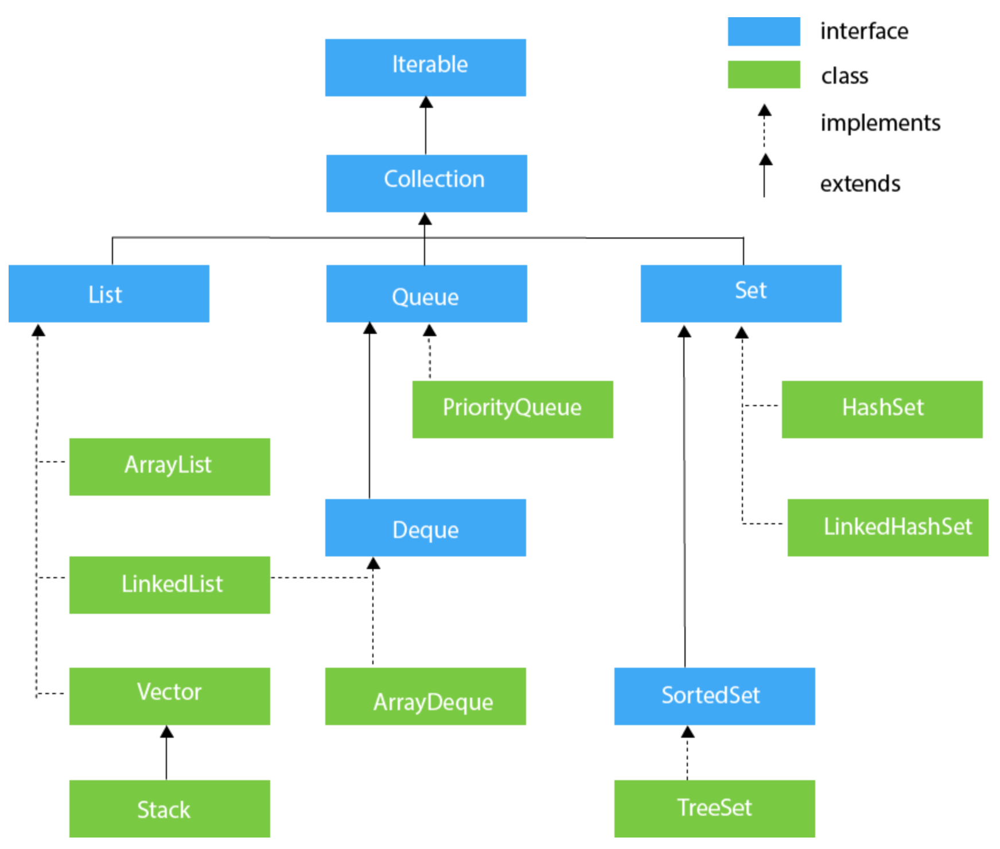
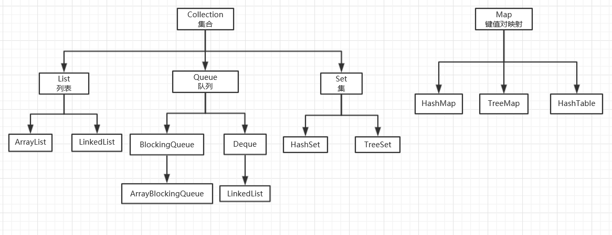

- [Java Learning](#java-learning)
  - [Errors](#errors)
    - [`Cannot infer type arguments for testForGeneric<>`](#cannot-infer-type-arguments-for-testforgeneric)
  - [Skills](#skills)
    - [`Comparator`](#comparator)
  - [Generic](#generic)
      - [Object <-> Comparable](#object---comparable)
  - [Collections](#collections)

# Java Learning

## Errors

###  `Cannot infer type arguments for testForGeneric<>`   
CODE:
```java
public class testForGeneric<T extends Comparable<T>> {

public testForGeneric(T[] a) {
}

public static void main(String[] args) {
    int[] a = { 3, 2, 4, 5, 6, 8, 9, 10, 7 };
    testForGeneric<Integer> t = new testForGeneric<>(a);
}
```

because `a` is a `int` array,while `testForGeneric` requires a `Integer` array.

and I wonder Java can't figure it out by itself?`int` auto to `Integer`

---
## Skills
### `Comparator`
<p><code>Comparable &amp; Comparator</code>都是用来实现集合中元素的比较、排序的，只是 Comparable 是在集合内部定义的方法实现的排序，<code>Comparator</code> 是在集合外部实现的排序。</p>

如果想要自己实现一个与之前的定义不同的比较方法（@overide），就必须使用`Comparator`接口。

example：
```java
public class A{...}

// Another Class for A's Comparator
public class AComparator implements Comparator<A>{
    @override
    public int compare(A a,A b){
        return a.someAttribute - b.someAttribute;
    }
}
// When using Arrays.sort()
A instance[] = new A();
Arrays.sort(instance,new AComparator());
```

---
## Generic
#### Object <-> Comparable

1. `Object`数组可以转化（强制转化）为泛型数组，却不能转化为实际的 **类**(`Point`类)
   解释：Java数组虽然是引用但是有一个检查机制：即检查数组中存储的元素是否为所声明要存储的元素……？（至于为什么……？除了安全考虑，我觉得没别的原因了，毕竟只是存一个引用，没必要提前分配好一块看空间
2. 为什么必须是`Comparable`而不能是`Object`？嗯，这个我暂时还没想明白……可能的原因是为了保证你所声明的（即`T`继承了`Comparable`的*可比较*特性）特性能够满足吧。所以虽然有 ***泛型擦除*** 机制，但是也不是直接擦除到`Object`。   
关于泛型擦除还有待 ***进一步*** 的阅读。


```java
package m.ttest;

import java.awt.Point;

/**
 * TEST
 */
public class TEST<T extends Comparable<T>> {

    private T[] t;

    public TEST(T[] a) {
        int N = a.length;
        t = (T[]) new Comparable[N];// ATTENTION can't be Object[N]!
        for (int i = 0; i < N; i++) {
            t[i] = a[i];
        }
        for (int i = 0; i < N; i++) {
            System.out.print(t[i].toString() + '\t');
        }
    }

    public static void main(String[] args) {
//====================TEST 1============================//
        Point[] a = new Point[10];
        // Point[] a = (Point[]) new Object[10];
        for (int i = 0; i < a.length; i++) {
            a[i] = new Point(10, 20);
        }
        System.out.print(a[0]);
//=====================TEST 2================================//
        Integer x[] = { 1, 2, 3, 4, 5, 6, 7 };
        TEST<Integer> u = new TEST<Integer>(x);
    }
}
```
---

## Collections



