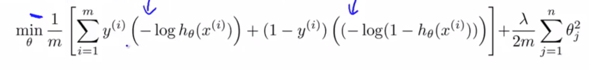
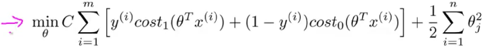
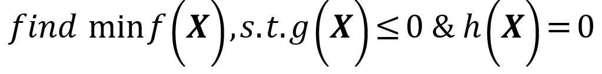
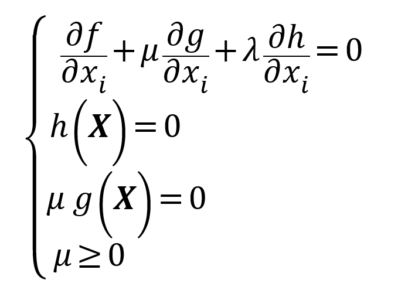
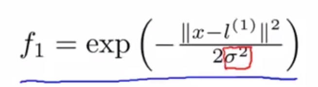
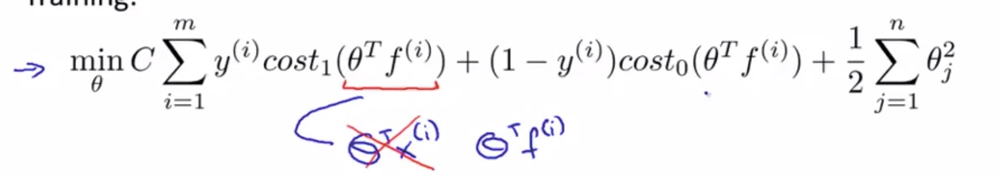
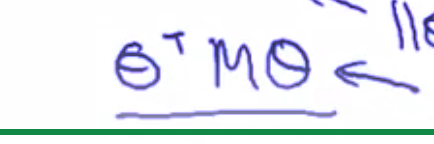

# Logistic Regression Review

稍作变化转化为SVM形式：

---
# KKT

## Conclusion
对于具有不等式(等式当然更可以)约束的最优化问题：   

KKT 条件：

# Reference
> [SVM知乎](https://zhuanlan.zhihu.com/p/24638007)   
> [浅谈最优化问题的KKT条件](https://ask.hellobi.com/blog/dataman/8241)

---
# 非线性
## Kernel
标记：   
将样本直接作为标记点！

- [ ] f_0=1 Why? 截距？

---
similarity function：   

（高斯核函数）

