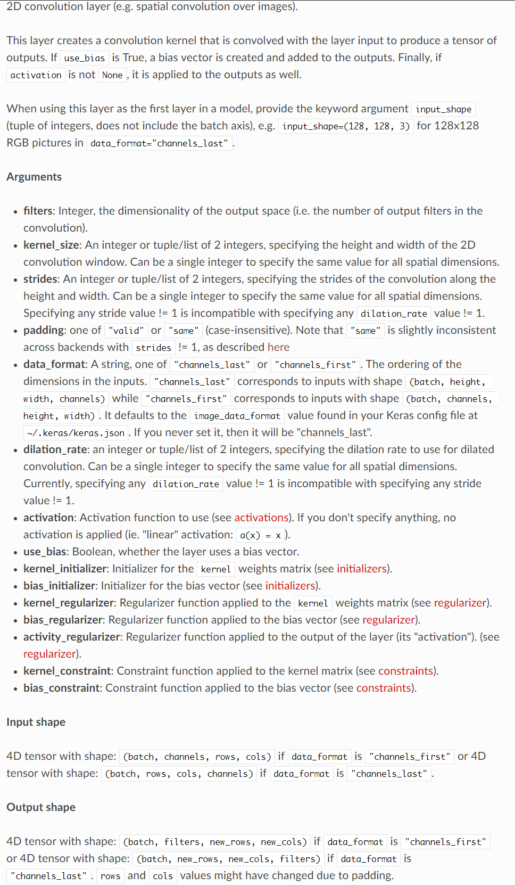
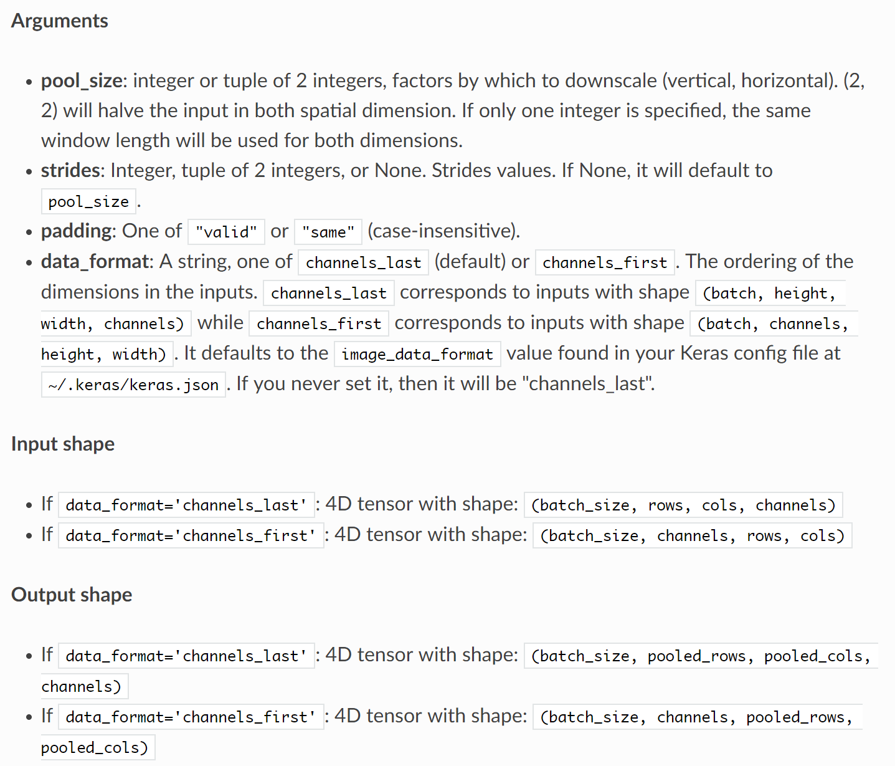
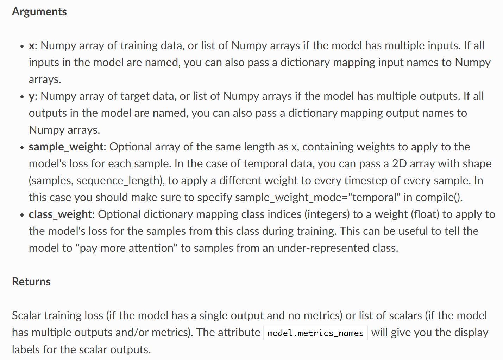

- [Convolution and Pooling](#convolution-and-pooling)
  - [Conv2D](#conv2d)
  - [Pooling](#pooling)
- [Dense](#dense)
  - [参数：](#%e5%8f%82%e6%95%b0)
  - [输入](#%e8%be%93%e5%85%a5)
  - [输出](#%e8%be%93%e5%87%ba)
- [compile](#compile)
- [loss](#loss)
  - [主要的loss函数](#%e4%b8%bb%e8%a6%81%e7%9a%84loss%e5%87%bd%e6%95%b0)
- [Optimizer](#optimizer)
    - [SGD](#sgd)
      - [参数](#%e5%8f%82%e6%95%b0)
      - [RMSprop](#rmsprop)
      - [参数](#%e5%8f%82%e6%95%b0-1)
    - [Adam](#adam)
      - [参数](#%e5%8f%82%e6%95%b0-2)
- [train_on_batch](#trainonbatch)

#Keras API
## Convolution and Pooling
### [Conv2D](https://keras.io/layers/convolutional/#Conv2D)
```python
keras.layers.Conv2D(filters, kernel_size, strides=(1, 1), padding='valid', data_format=None, dilation_rate=(1, 1), activation=None, use_bias=True, kernel_initializer='glorot_uniform', bias_initializer='zeros', kernel_regularizer=None, bias_regularizer=None, activity_regularizer=None, kernel_constraint=None, bias_constraint=None)
```
最主要的参数：
第一层需要额外定义的参数是:`input_shape=(raw, col, n_c=1 or 3)`作为另一个选择：`batch_input_size=(None, raw, col, n_c=1 or 3)`

其他参数是：   
- `filters` for num of filters   
- `kernal_size`    
- `padding` 可以选择`'valid'`或者`'same'`（好像same更好，保证每一层在做完运算后都是一样的   
- `strides`


<details>
<summary>参数介绍</summary>



</details>

### [Pooling](https://keras.io/layers/pooling/)

```py
keras.layers.MaxPooling2D(pool_size=(2, 2), strides=None, padding='valid', data_format=None)
```

一般选择`MaxPool2D`   
参数为：   
- `pool_size` 
- `strides`
- `padding`

<details>
<summary>参数介绍</summary>



</details>

## [Dense](https://keras-cn.readthedocs.io/en/latest/layers/core_layer/#dense)
```python
keras.layers.core.Dense(units, activation=None, use_bias=True, kernel_initializer='glorot_uniform', bias_initializer='zeros', kernel_regularizer=None, bias_regularizer=None, activity_regularizer=None, kernel_constraint=None, bias_constraint=None)
```

<details>
<summary>参数介绍</summary>
Dense就是常用的全连接层，所实现的运算是```output = activation(dot(input, kernel)+bias)```。其中```activation```是逐元素计算的激活函数，```kernel```是本层的权值矩阵，```bias```为偏置向量，只有当```use_bias=True```才会添加。

如果本层的输入数据的维度大于2，则会先被压为与```kernel```相匹配的大小。

这里是一个使用示例：

```python
# as first layer in a sequential model:
# as first layer in a sequential model:
model = Sequential()
model.add(Dense(32, input_shape=(16,)))
# now the model will take as input arrays of shape (*, 16)
# and output arrays of shape (*, 32)

# after the first layer, you don't need to specify
# the size of the input anymore:
model.add(Dense(32))
```

### 参数：

* units：大于0的整数，代表该层的输出维度。

* activation：激活函数，为预定义的激活函数名（参考[激活函数](../other/activations)），或逐元素（element-wise）的Theano函数。如果不指定该参数，将不会使用任何激活函数（即使用线性激活函数：a(x)=x）

* use_bias: 布尔值，是否使用偏置项

* kernel_initializer：权值初始化方法，为预定义初始化方法名的字符串，或用于初始化权重的初始化器。参考[initializers](../other/initializations)

* bias_initializer：偏置向量初始化方法，为预定义初始化方法名的字符串，或用于初始化偏置向量的初始化器。参考[initializers](../other/initializations)

* kernel_regularizer：施加在权重上的正则项，为[Regularizer](../other/regularizers)对象

* bias_regularizer：施加在偏置向量上的正则项，为[Regularizer](../other/regularizers)对象

* activity_regularizer：施加在输出上的正则项，为[Regularizer](../other/regularizers)对象

* kernel_constraints：施加在权重上的约束项，为[Constraints](../other/constraints)对象

* bias_constraints：施加在偏置上的约束项，为[Constraints](../other/constraints)对象


### 输入

形如(batch_size, ..., input_dim)的nD张量，最常见的情况为(batch_size, input_dim)的2D张量

### 输出

形如(batch_size, ..., units)的nD张量，最常见的情况为(batch_size, units)的2D张量

</details>

---

## [compile](https://keras-cn.readthedocs.io/en/latest/legacy/models/model/#compile)
`model`的方法   
参数为：
```python
model.compile(self, optimizer, loss, metrics=[], loss_weights=None, sample_weight_mode=None)
```

<details>
<summary>参数介绍</summary>
本函数编译模型以供训练，参数有

* optimizer：优化器，为预定义优化器名或优化器对象，参考[<font color='#FF0000'>优化器</font>](../other/optimizers.md)

* loss：目标函数，为预定义损失函数名或一个目标函数，参考[<font color='#FF0000'>目标函数</font>](../other/objectives.md)

* metrics：列表，包含评估模型在训练和测试时的性能的指标，典型用法是```metrics=['accuracy']```如果要在多输出模型中为不同的输出指定不同的指标，可像该参数传递一个字典，例如```metrics={'ouput_a': 'accuracy'}```

* sample_weight_mode：如果你需要按时间步为样本赋权（2D权矩阵），将该值设为“temporal”。默认为“None”，代表按样本赋权（1D权）。如果模型有多个输出，可以向该参数传入指定sample_weight_mode的字典或列表。在下面```fit```函数的解释中有相关的参考内容。

* kwargs：使用TensorFlow作为后端请忽略该参数，若使用Theano作为后端，kwargs的值将会传递给 K.function

【Tips】如果你只是载入模型并利用其predict，可以不用进行compile。在Keras中，compile主要完成损失函数和优化器的一些配置，是为训练服务的。predict会在内部进行符号函数的编译工作（通过调用_make_predict_function生成函数）
</details>

---
## [loss](https://keras.io/losses/)

first:

```python
from keras import losses
```

second: how to using   
in `model.compile()`:   
```python
loss=losses.mean_squared_error
```

### 主要的loss函数
1. mean_squared_error
2. mean_absolute_error
3. mean_squared_logarithmic_error
4. hinge
5. categorical_crossentropy
6. binary_crossentropy
   
> [losses source code](https://github.com/keras-team/keras/blob/master/keras/losses.py)

---
## [Optimizer](https://keras-cn.readthedocs.io/en/latest/legacy/other/optimizers)

可以在调用```model.compile()```之前初始化一个优化器对象，然后传入该函数（如上所示），也可以在调用```model.compile()```时传递一个预定义优化器名。在后者情形下，优化器的参数将使用默认值。

ex：

```python
sgd = SGD(lr=0.01, decay=1e-6, momentum=0.9, nesterov=True)
model.compile(loss='mean_squared_error', optimizer=sgd)
```

> `lr` for learning rate

<details>
<summary>各个优化器简介</summary>

#### SGD
```python
keras.optimizers.SGD(lr=0.01, momentum=0.0, decay=0.0, nesterov=False)
```
随机梯度下降法，支持动量参数，支持学习衰减率，支持Nesterov动量

##### 参数

* lr：大于0的浮点数，学习率

* momentum：大于0的浮点数，动量参数

* decay：大于0的浮点数，每次更新后的学习率衰减值

* nesterov：布尔值，确定是否使用Nesterov动量

***

##### RMSprop
```python
keras.optimizers.RMSprop(lr=0.001, rho=0.9, epsilon=1e-06)
```
除学习率可调整外，建议保持优化器的其他默认参数不变

该优化器通常是面对递归神经网络时的一个良好选择

##### 参数

* lr：大于0的浮点数，学习率

* rho：大于0的浮点数

* epsilon：大于0的小浮点数，防止除0错误

***

#### Adam
```python
keras.optimizers.Adam(lr=0.001, beta_1=0.9, beta_2=0.999, epsilon=1e-08)
```

该优化器的默认值来源于参考文献

##### 参数

* lr：大于0的浮点数，学习率

* beta_1/beta_2：浮点数， 0<beta<1，通常很接近1

* epsilon：大于0的小浮点数，防止除0错误

</details>

## [train_on_batch](https://keras.io/models/model/#train_on_batch)
```py
train_on_batch(x, y, sample_weight=None, class_weight=None)
```
- `x`: Numpy array of training data
- `y`: Numpy array of target data
- returns: training loss

<details>
<summary></summary>



</details>