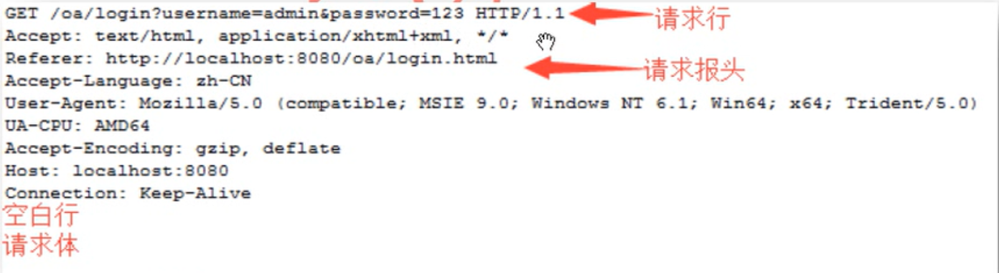
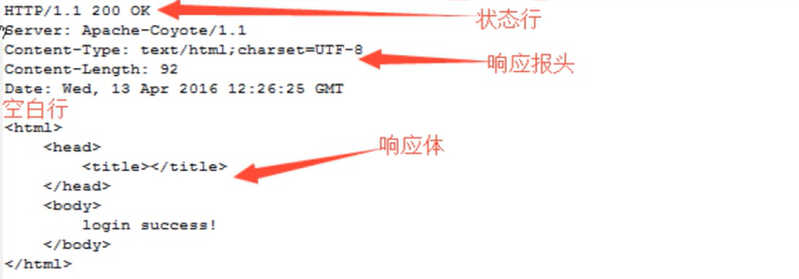

# B/S架构
## B/S架构的参与者
- Web客户端 browser
- Web服务器 Server
- Webapp
- 数据库服务器

## 各个参与者之间的接口与协议
- Browser和Server之间 是 W3C 制定的http协议
- Server和web App之间是Sun制定的servlet接口
- web app和数据库服务器之间是sun的jdbc接口

# HTTP协议

浏览器向服务器发送数据：request   
服务器向浏览器返回数据：respond

## 请求协议

1. 请求行
2. 请求报头
3. 空白行
4. 请求体

## 响应协议

1. 状态行 ： 协议版本号，状态码：200；404；500，状态值：OK，NotFound，
2. 响应报头
3. 空白行
4. 响应体

# Socket编程
