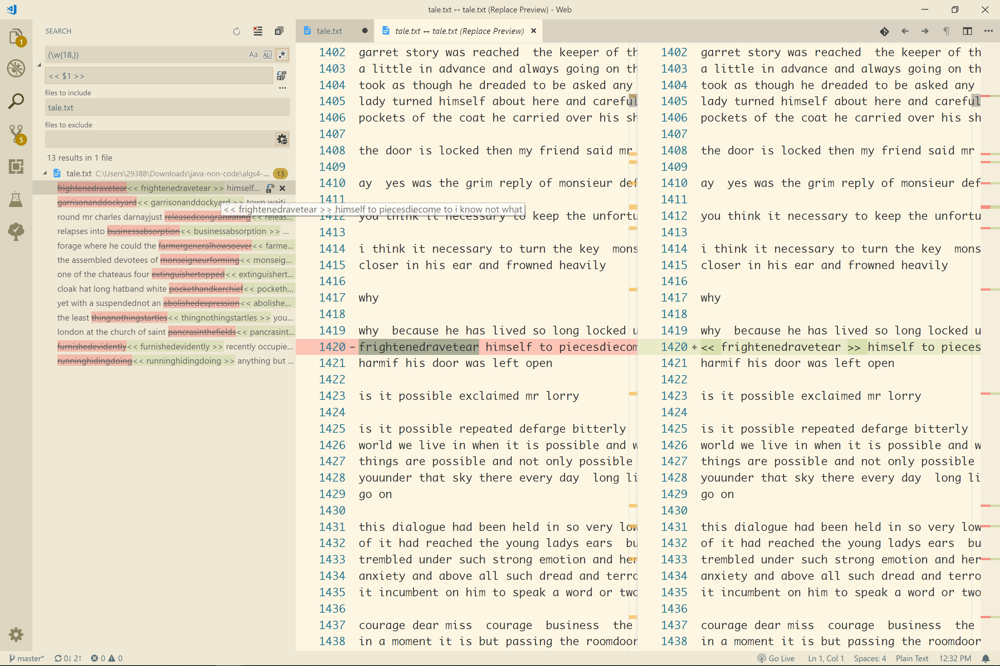

[Regex Web](https://regexr.com/)

---

`(\w{18,})`   
所有长度>=18单词   

`$1`,`$2`这种是用来在**替换**的时候标记 当时由`(...)`所围住的 groups

---

`(\w{2})v\1`

- \1 backreference 用在**搜索**的时候，用来反向标记上1个查到的group（`\2`就是倒数第2个group）
- 替换的时候会将整个搜索结果（例如：`erver`）结果替换为`$1_`（`erver`-->`er_`）

# 高级查找
