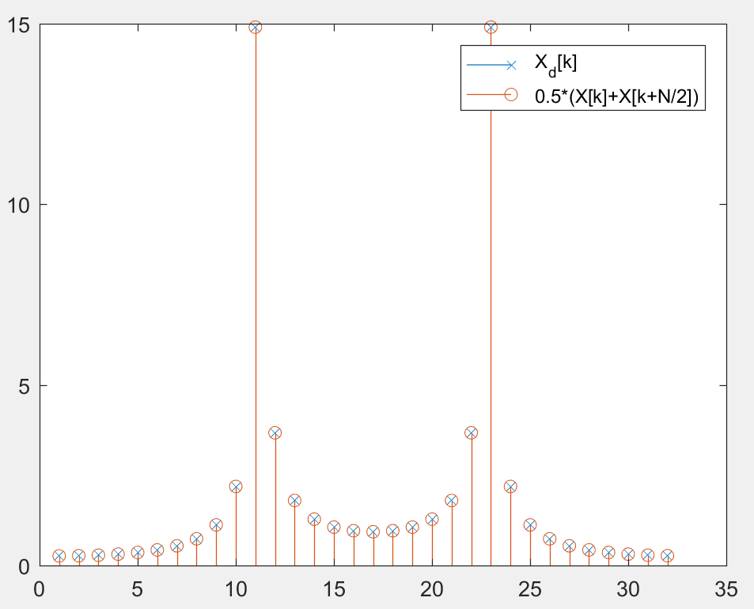
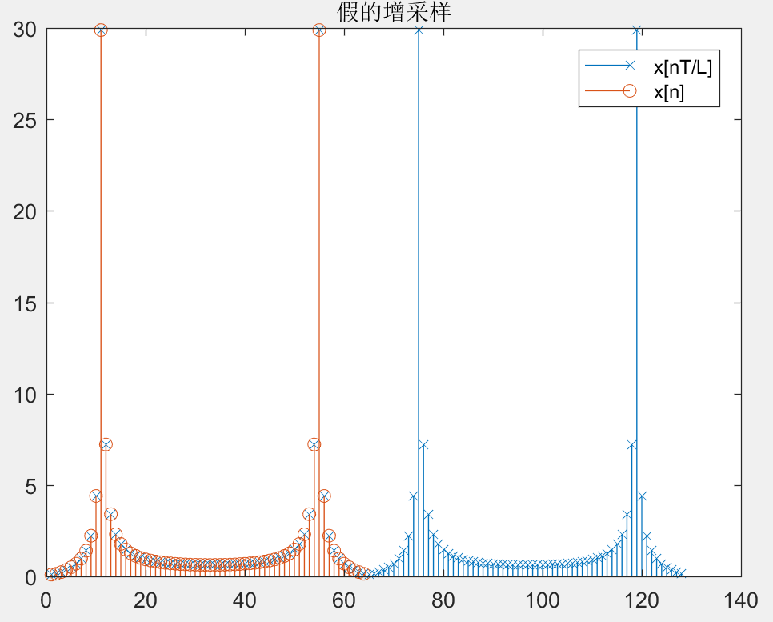
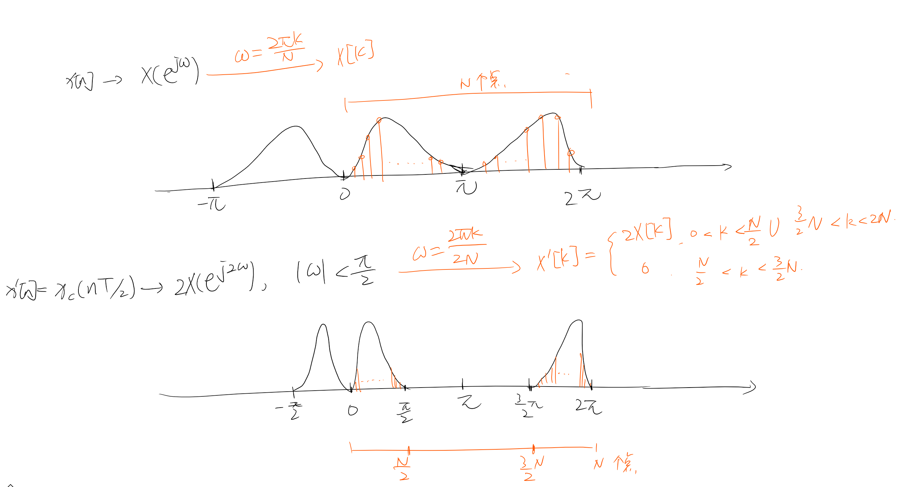
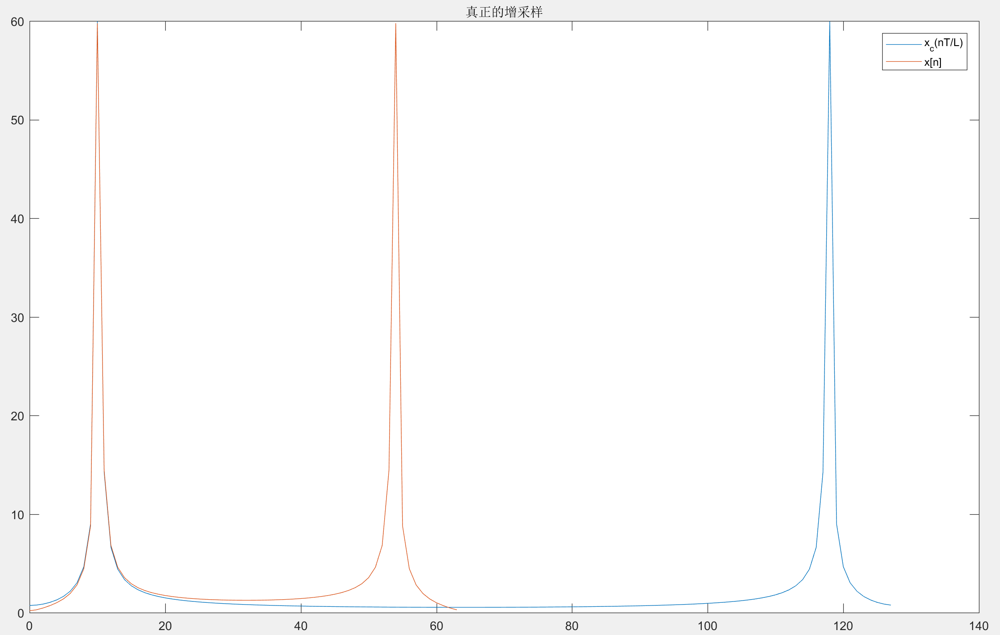
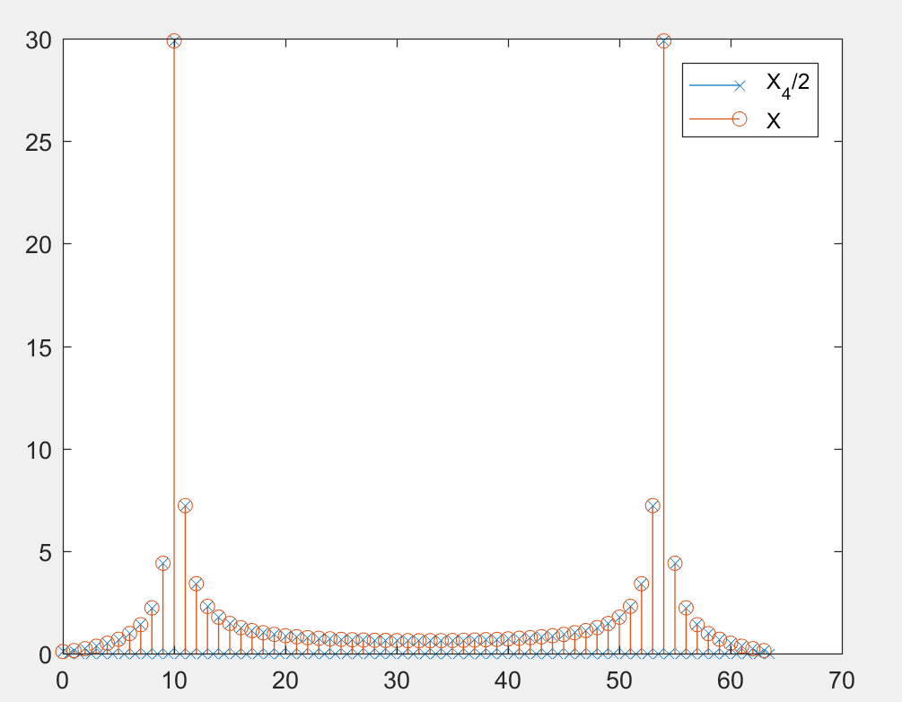
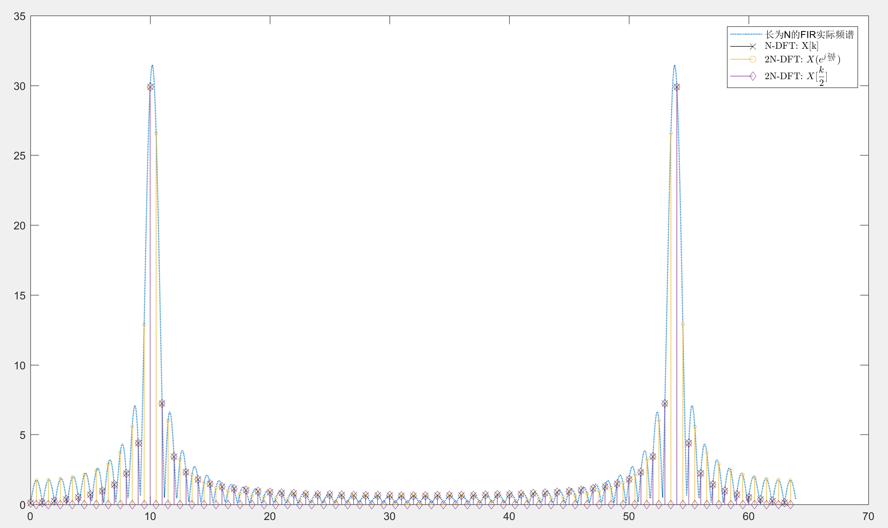
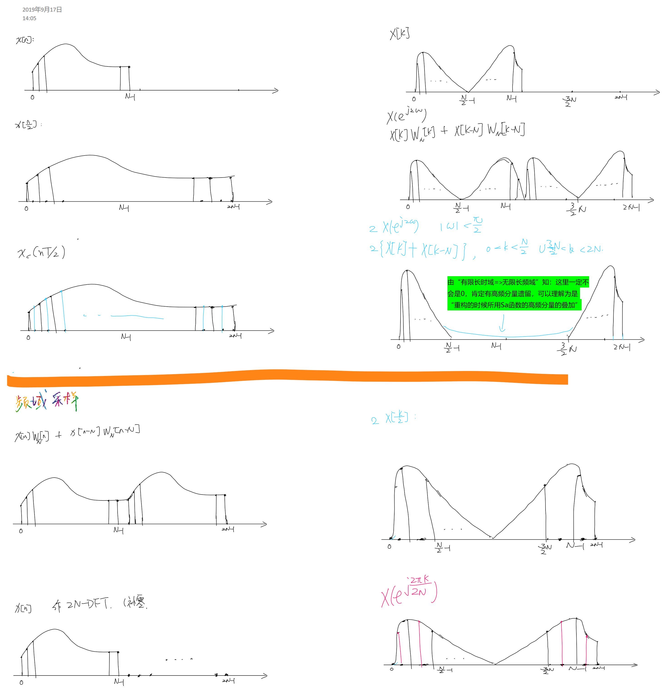

- [DFT分析连续信号](#dft分析连续信号)
- [DFT求某些点的Z变换（DTFT）](#dft求某些点的z变换dtft)
  - [题目](#题目)
- [循环卷积和线性卷积](#循环卷积和线性卷积)
- [线性相位的拓展](#线性相位的拓展)
- [增减采样在DFT上的体现（再认识）](#增减采样在dft上的体现再认识)
  - [减采样](#减采样)
      - [1) 连续频域](#1-连续频域)
      - [2) 离散频域](#2-离散频域)
  - [增采样](#增采样)
    - [Ⅰ.未经内插的“增采样”](#Ⅰ未经内插的增采样)
      - [1) 连续频域](#1-连续频域-1)
      - [2) 离散频域](#2-离散频域-1)
    - [Ⅱ.真正的增采样](#Ⅱ真正的增采样)
      - [1) 连续频域](#1-连续频域-2)
      - [2) 离散频域](#2-离散频域-2)
- [频域采样的变化给时域带来的变化](#频域采样的变化给时域带来的变化)
  - [减采样](#减采样-1)
  - [增采样](#增采样-1)
    - [1) 假的增采样](#1-假的增采样)
  - [时域](#时域)
    - [2) 真的增采样](#2-真的增采样)
- [总结 记忆](#总结-记忆)
  - [时域有限，频域无限；频域有限，时域无限](#时域有限频域无限频域有限时域无限)
  - [时域 频域 增采样](#时域-频域-增采样)
- [习题](#习题)

[matlab参考文件][reffile]
# DFT分析连续信号
DFT的第k个 如何 对应到连续时间的$X_c(j\Omega)$:

$$
\displaystyle{X[k]=X(e^{j\omega})\bigg|_{\omega=\dfrac{2\pi k}{N}}=\dfrac{1}{T}X_c(j\Omega)\bigg|_{\Omega=\dfrac{\omega}{T}=\dfrac{2\pi k}{NT}}}
$$

# DFT求某些点的Z变换（DTFT）
1. $z=re^{j(\frac{2\pi}{N}k+\phi_0)}=re^{\phi_0}\cdot e^{j(\frac{2\pi}{N}k)}$
由上式：
$$
\begin{aligned}
  &X(z)|_{z=re^{j(\frac{2\pi}{N}k+\phi_0)}}\\
  =&X(z)|_{z=re^{\phi_0}\cdot e^{j(\frac{2\pi}{N}k)}}\\
  \Rightarrow&X(z\cdot re^{\phi_0})|_{e^{j(\frac{2\pi}{N}k)}}
\end{aligned}
$$
一般来说让你变化一下原来的$x[n]$，已通过DFT求得：
根据

$X(z/z_0)\Rightarrow z_0^nx[n]$

可求。
## 题目
DSP课本：
- [ ] 真题：8.61
- [ ] 9.27

# 循环卷积和线性卷积
两个原序列：$x_1[n],x_2[n]$，循环卷积得到的序列$x_{3r}[n]$，线性卷积得到的$x_3[n]$.
$$
x_{3r}[n]=\displaystyle\sum_{r=0}^{N-1}x_1[r]x_2[(N-r)\%N]
$$
1. 循环卷积的计算方法：将序列$x_2[n]$进行周期为$N$的延拓，再进行线性卷积
2. 另外一种计算方法**更合适**：也就是**线性卷积**和**循环卷积**的关系：
    先算出线性卷积，再以$N$为周期进行延拓。

    在频域上，就是先变成$X_1(e^{j\omega})X_2(e^{j\omega})$，再以$N$频域采样。

    “先卷积再延拓 和 先延拓再卷积是一样的”

# 线性相位的拓展
什么性质的$x[n]$才具有$A[k]e^{j\alpha k}$形式的DFT？

动动脑子：

当然是 $\widetilde{x}[n]$具有对称性的（只是充分条件）

# 增减采样在DFT上的体现（再认识）
## 减采样
$$
x_d[n]=x[Mn]
$$
总长度$N'=N/M$（假设能够整除）
#### 1) 连续频域
$$
X_d(e^{j\omega})=\frac{1}{M}\sum_{r=1}^{M-1}X(e^{j\frac{\omega-2\pi r}{M}})
$$
#### 2) 离散频域
在$N\%M==0$的情况下

直接利用$\omega=\dfrac{2\pi k}{N/M}$的关系式，带入到上式中：
$$
X_d[k]=\frac{1}{M}\sum_{r=1}^{M-1}X\left[k-r\dfrac{N}{M}\right]\qquad  k=0,1,...,\left(\frac{N}{M}-1\right)
$$

> 从记忆的角度来说，“频域采样，时域周期延拓”==>“时域采样，频域周期延拓”：原来以N为周期周期延拓，现在以N/M为周期延拓

例子：M=2时DFT结果是

$X_d[k]=\frac{1}{2}\{X[k]+X[k+\frac{N}{2}]\},\qquad k=0,..,\frac{N}{2}-1$

fig:

## 增采样
### Ⅰ.未经内插的“增采样”
直接在离散的$x[n]$上进行操作。

$$
x_e[n]=\begin{cases}
    x[n/L]&,n=0,L,2L,...,(N-1)L\\
    0&,others
\end{cases}
$$
总长度$N' = NL$
#### 1) 连续频域
$$
X_e(e^{j\omega})=X(e^{jL\omega}))
$$
#### 2) 离散频域
$$
X_e[k]=\sum_{r=0}^{L-1}X[k-rN]
$$
看似一样，但是记住 ***DFT要在DFS*** 上来看：
这里的离散频域的长度为$NL$，就是DFS截取了得更长了。
（或者说将$X[k]$以N为周期平移L次）

还是上边那句话：
> 时域采样，频域周期延拓
> 对于DFT这种离散的情况来看，似乎这种采样更应该称之为 **采样**

图：

与下文将要讲述的“真的”增采样不同，这个采样方式得到的结果是***完全重合***的

### Ⅱ.真正的增采样
经过低通滤波器滤去主值以外的图形，在时域上的表现就是经过了一边 重构 ==> 内插，其表达式为

$$
x_i[n]=x_c(nT/L)
$$

#### 1) 连续频域
$$
X_i(e^{j\omega})=LX(e^{jL\omega})\quad{\color{red}{\omega<|\pi/L|}}
\overset{DTFT}{\xLeftarrow{}}x_c(nT/L)
$$

#### 2) 离散频域
在频域以$\dfrac{2\pi k}{NL}$采样
$$
X_i[k]=\begin{cases}
    LX[k]&,0<\omega<\frac{N}{2}\cup NL-\frac{N}{L}<\omega<NL\\
    0&,others
\end{cases}
$$
应该是：

***实际上的结果：***

fig:

***上图中为什么两个曲线没有像上文中得出的结果？***

原因：

实际上，如果图象是带限的，那么理应在32到95之间（见上）为0。但是问题是函数**不带限**!

如果一个$X(e^{j\omega})$在$\omega_c<\pi$点之后都截止了，那么其IDTFT一定是一个无限长度的脉冲响应。如果是FIR，那么一定是经过了 加窗 操作。所以实际上用计算机处理的时候都是不带限的。

那么为什么不带限就出现了不为0呢？

这时候就要说一说这个图是怎么来的（可参见[matlab文件][reffile]），我们已经假设 已经知道了被采样的信号，而由于被采样的信号**不是带限**，那么我们增采样之后，由$X_c(j\frac{\omega-2\pi r}{T/2})$可以看出确实是图中结果，而且增采样之后的高频部分（中间部分）**更低**了。

# 频域采样的变化给时域带来的变化
## 减采样
同样的道理，$X(e^{j\frac{2\pi k}{MN}})$或者$X[Mk]$   
得到的时域变化是：
$$
\sum_{r=0}^{M-1}x\left[n+r\frac{N}{M}\right],n=0,1,...,\color{red}{\frac{N}{M}-1}
$$
即，时域以周期$\dfrac{N}{M}$重新进行周期延拓，且长度变为$\dfrac{N}{M}$

看起来就好像把长度为$N$的$x[n]$压缩在了$\dfrac{N}{M}$的长度内.

> 注意：不像[时域的结果](##减采样)，频域的减采样不会除以**M**.

## 增采样
### 1) 假的增采样
$$
X'[k]=\begin{cases}
    X[k/L]&,k=0,L,2L,...,(N-1)L
    \\
    0
\end{cases}
$$
共$NL$个点。
## 时域
(其实由于DFT和IDFT具有几乎一样的计算公式，我们完全可以推测出结果)
$$
x'[n]={\color{red}{\dfrac{1}{L}}}\sum_{r=0}^{L-1}x[n-rL]
$$
即：将$x[n]$平移$N$次，得到长度为$NL$的$x'[n]$.

fig:

### 2) 真的增采样 
$$
X(e^{j\frac{2\pi k}{N/L}})
$$
这个就是***时域补零***的效果

fig:

# 总结 记忆
## 时域有限，频域无限；频域有限，时域无限
有限，实际上指的是加窗

测不准原理：妙啊！

## 时域 频域 增采样

# 习题
DSP 第八章 

8.37

Answer

[reffile]:dft.mlx

