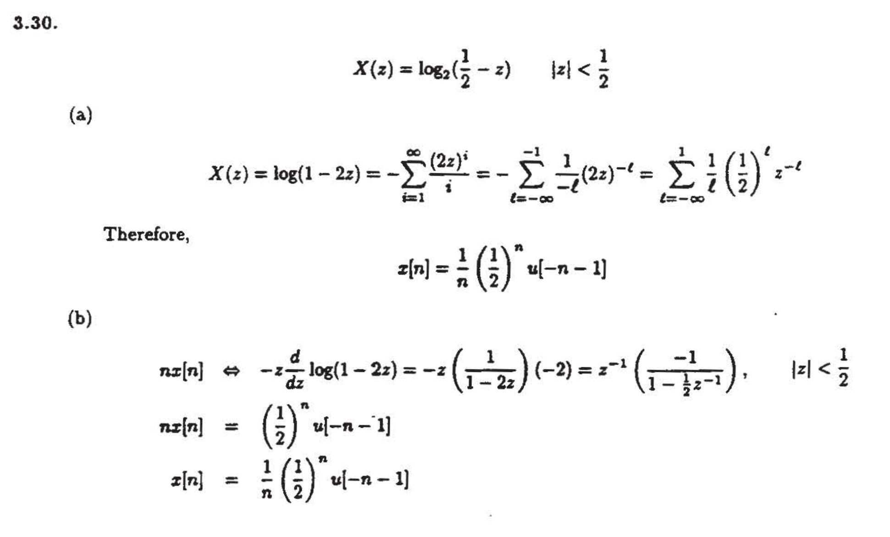

# 复杂$X(z)$的反变换
1. 由于反变换其实就相当于$X(z)$的洛朗展开，所以直接洛朗展开即可。
2. 利用*微分性质*：$-nx[n]\Rightarrow {\color{red}{}z}\dfrac{\mathrm{d}X(z)}{\mathrm{d}z}$

### 例题

同理，$X(z)=\sin{z}$的反变换呢？

3. 等比数列公式：$\dfrac{1}{1-z^{-4}}=\displaystyle\sum_{n=0}^{+\infty}z^{-4n}$