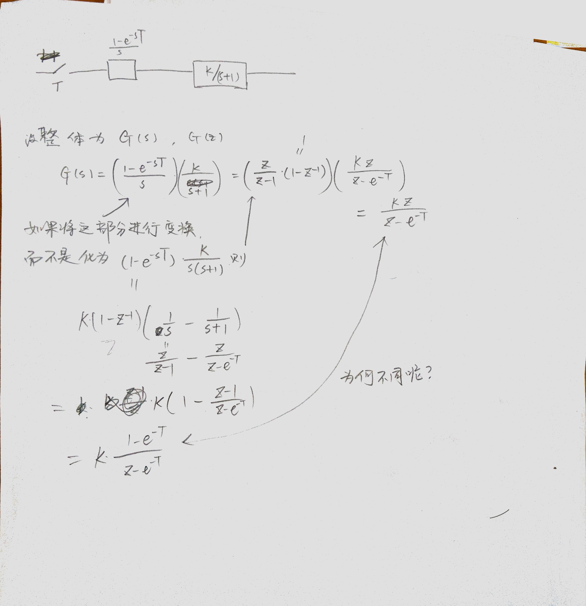

# 关于Laplace变换有指数项$e^{-st_0}$的情况
[留数法求拉普拉斯逆变换，当像函数有指数项的时候出错？][1]

这是一个在《自控》里再次遇到的问题——在含有零阶保持器($L(h(t))=(1-e^{-sT})/s$)的采样电路中，将该零阶保持器使用$L\rightarrow Z$直接转换：
$$ Z\left\{ \frac{1-e^{-sT}}{s}\right\} = Z\{(u(t)-u(t-T))|_{t=nT} \}=Z\{\delta(n)\}=1$$
(这个实际上是对的……)
出现了问题，在自控里出现的这个错误还有一个原因：
$$ G_1G_2(z)\ne G_1(z)G_2(z) $$
不过更严重的问题还是错误认为$(1-e^{-sT})/s$的$\rm{InverseLaplaceTransform}$是$1$.

问题的答案可以参考最顶上的[链接][1]，总结一下就是因为$L(s)$中有$e^{s}$项，所以在取围道积分的时候弧形围道$\oint_{C_R}L(s)e^{st}ds\to{\infty}$。非要用留数计算的方法[链接][1]中已经说了。   
而最好的办法还是将含有之水想的式子拆出来。

关于自控的这个问题：

[1]:https://www.zhihu.com/question/271910536
