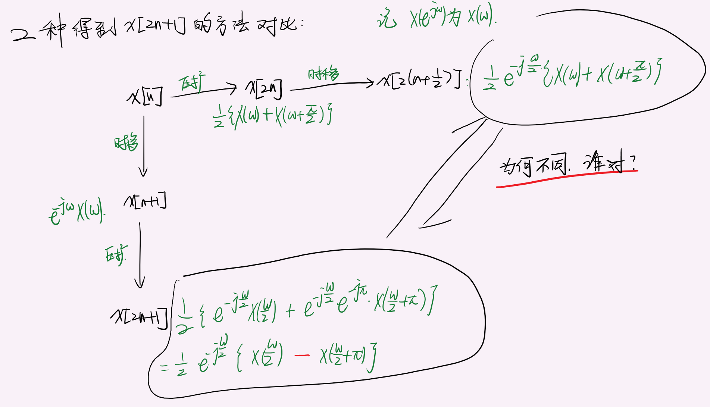

# 终值定理和初值定理
|          | Z                                                                | Laplace                                                      |
| -------- | :--------------------------------------------------------------- | :----------------------------------------------------------- |
| 初值定理 | $x[0]=\lim\limits_{z\rightarrow\infty}{X(z)}$                    | $x(0_+)=\lim\limits_{s\rightarrow\infty}{sX(s)}$             |
| 终值定理 | $x[+\infty]=\lim\limits_{z\rightarrow\color{red}{1}}{(z-1)X(z)}$ | $x(+\infty)=\lim\limits_{s\rightarrow\color{red}{0}}{sX(s)}$ |

> 其实$Z$变换的这个很好记：因为是求和的时候是×$z^{-n}$，所以，趋于无穷的时候，$X(z)$所有项就剩下$x[0]$了。
>
> 而终值定理则，不严谨的记忆，就是*错位相减*，只剩下最后一项

> ATTENTION:初值定理要求x(0)处没有冲击函数；即若H(s)中零点个数大于或等于极点个数，则初值定理不可使用
---
# $Paserval$定理
|        |                                                                                                                                              |
| :----- | :------------------------------------------------------------------------------------------------------------------------------------------- |
| $CTFT$ | $\displaystyle\int\limits_{-\infty}^{\infty}x(t)y^*(t)\rm{}dt=\dfrac{1}{2\pi}\int\limits_{-\infty}^{\infty}X(\Omega)Y^*(\Omega)\rm{}d\Omega$ |
| $DTFT$ | $\displaystyle\sum\limits_{n=-\infty}^{\infty}x[n]y^*[n]=\dfrac{1}{2\pi}\int\limits_{-\infty}^{\infty}X(e^{j\omega})Y^*(e^{jw})\rm{}d\omega$ |
| $DFT$  | $\displaystyle\sum_{n=0}^{N-1}x[n]y^*[n]=\dfrac{1}{N}\displaystyle\sum_{k=0}^{N-1}X[k]Y^*[k]d$                                               |
> 随机过程里还有一个叫[维纳-辛钦定理](https://en.wikipedia.org/wiki/Wiener–Khinchin_theorem)，也是类似的结论.

---
# 线性函数$nx[n]$/$tx(t)$ 频域微分
Z变换的那个 和幂级数求和函数差不多，只是由于Z变换时$z^{-n}$所以是$-nx[n]$；

所以通过记忆Z变换来记忆Laplace更方便

ATTENTION：DTFT的这个***没有负号***

|                                    Z                                    |                        Laplace                         |                               CTFT                                |                                  DTFT                                  |
| :---------------------------------------------------------------------: | :----------------------------------------------------: | :---------------------------------------------------------------: | :--------------------------------------------------------------------: |
| $-nx[n]\Rightarrow {\color{red}{}z}\dfrac{\mathrm{d}X(z)}{\mathrm{d}z}$ | $-tx(t)\Rightarrow\dfrac{\mathrm{d}X(s)}{\mathrm{d}s}$ | $tx(t)\Rightarrow j\dfrac{\mathrm{d}X(\Omega)}{\mathrm{d}\Omega}$ | $nx[n]\Rightarrow j\dfrac{\mathrm{d}X(e^{j\omega})}{\mathrm{d}\omega}$ |

---
# Z变换的频域压缩才对应其他三个变换的频移性质

| Z                                                | Laplace                         | CTFT                                                           | DTFT                                                       |
| :----------------------------------------------- | :------------------------------ | :------------------------------------------------------------- | :--------------------------------------------------------- |
| $a^nx[n]\Rightarrow{X\left(\dfrac{z}{a}\right)}$ | $e^{at}x(t)\Rightarrow{X(s-a)}$ | $e^{j\Omega_0t}x(t)\Rightarrow{X\left(\Omega-\Omega_0\right)}$ | $e^{j\omega_0n}x[n]\Rightarrow{X(e^{j(\omega-\omega_0)})}$ |

---

# 时域微分(时移) 等
对于$\mathscr{Z}$变换来说，时移实际上是差分了。

对于单边变换来说，需要考虑初始条件。

|           | Laplace                                                                                                                             | Z                                                                      |
| --------- | ----------------------------------------------------------------------------------------------------------------------------------- | ---------------------------------------------------------------------- |
| 微分/差分 | $\mathscr{L}\left\{x'(t)\right\}=sX(s){\color{red}-}x(0_-)$                                                                         | $\mathscr{Z}\left\{x[n-1]{\color{red}{u[n]}}\right\}=z^{-1}X(z)+x[-1]$ |
| 积分/求和 | $\mathscr{L}\left\{\displaystyle{\int_{-\infty}^tx(v){\rm d}v}\right\}=\dfrac{X(s)}{s}+\dfrac{\int_{-\infty}^{0_-}x(v){\rm d}v}{s}$ | ——                                                                     |

> 实际上$\mathscr{Z}$变换的很好理解，因为单边变换的时移会将$x[-1]$的值移进来计算，所以最后是需要加上一个$x[-1]$.
## Laplace 和 Z 的时移比较
Laplace:
$\mathscr{L}[x(t-t_0){\color{red}{u(t-t_0)}}]\Rightarrow {\rm e}^{-st_0}X(s)$

Z:$\mathscr{Z}\left\{x[n-1]{\color{red}{u[n]}}\right\}=z^{-1}X(z)+x[-1]$    
$\mathscr{Z}\left\{x[n-1]{\color{red}{u[n-1]}}\right\}=z^{-1}X(z)$

## 问题来了
- [ ] 如果给的初始条件刚好不是所需的（比如:$x(2),x'(1)$怎么办？

# 频域积分（Laplace）
$\mathscr{L}\left[\dfrac{1}{t}x(t)\right]=\displaystyle\int_s^{\infty}X(\eta)\mathrm{d}\eta$
# 压扩
Laplace：$\mathscr{L}[x(at)]=\dfrac{1}{|a|}X\left(\dfrac{s}{a}\right)$    
Z变换：$\mathscr{Z}\{x[Mn]\}=X\left(z^{\color{red}\frac{1}{M}}\right)$

而对应的离散时域上的时间压扩就变成了[增减采样](DFT.md)的问题了：   

不过有相似的频域形式：$\mathscr{Z}[a^nx[n]]=X\left(\dfrac{z}{a}\right)$

# 连续时间Fourier变换
## 对偶性
$$
\begin{aligned}
    x(t)&\rightarrow X(\omega)\\
X(t)&\rightarrow 2\pi x(-\omega)
\end{aligned}
$$

## 时域积分 和 频域积分
$$
\begin{aligned}
    \displaystyle\int_{-\infty}^tf(\tau)\mathrm{d}\tau&\rightarrow{}\dfrac{F(\omega)}{\rm{j}\omega}+\pi {\color{red}{}F}(0)\delta(\omega)\\
\dfrac{f(t)}{{\color{red}{-}}\rm{j}t}+\pi f(0)\delta(t)&\rightarrow \displaystyle\int_{-\infty}^\omega F(u)\mathrm{d}u
\end{aligned}
$$

## 抽样
和DSP讲的是一样的，只不过那里是离散的傅里叶变换，这里是用冲击表示的。

要记忆的：

周期冲击串的傅里叶变换：
$$
\delta_{T_s}(t)\rightarrow {\color{red}{}\frac{2\pi}{T_s}}\delta_{\color{red}{}{\frac{2\pi}{T_s}}}(\omega)
$$

# 变换对
$\mathscr{L}[{\color{red}{-}}\varepsilon(-t)]=\dfrac{1}{s},\sigma<0$
逆变换为左边函数的时候，直接在右边函数的结果变为$-f(t)\varepsilon(-t)$

# 共轭 和 对称
|                                              | Laplace    | CTFT                           | Z                            | DTFT                                              | DFT                   |
| -------------------------------------------- | ---------- | ------------------------------ | ---------------------------- | ------------------------------------------------- | --------------------- |
| 共轭($x^*(t)$或$x^*[n]$)                     | $X^*(s^*)$ | $X^*(-\operatorname{j}\omega)$ | $X^*(z^*)$                   | $X^*(\operatorname{e}^{-\operatorname{j}\omega})$ | $X^*[-k]$             |
| 对称($x(-t)$或$x[-n]$)对应*双边变换*         | $X(-s)$    | $X(-\operatorname{j}\omega)$   | $X\left(\dfrac{1}{z}\right)$ | $X(\operatorname{e}^{-\operatorname{j}\omega})$   | $X[-k]$               |
| $x(t)\otimes x^*(-t)$或$x[n]\otimes x^*[-n]$ | 见下       | $\lVert X(j\omega)\lVert^2$    | 见下                         | $\lVert X(e^{j\omega})\lVert^2$                   | $\lVert X[k]\lVert^2$ |
> 记Laplace 和 Z变换就行

> 注意：滤波器设计那里如的式子$H(s)H(-s)$实际上应该写成$H(s)H^*(-s^*)$（实际上对于零极点分析来说是一样的）
> 为什么要写成这样呢？   
> 是根据***自相关***来说的：
> 自相关的傅里叶变换是幅度，所以仍然从自相关导出拉普拉斯（或者Z变换）的表达式
> $h(t)\otimes h^*(-t)\Rightarrow H(s)H^*(-s^*)$，以及对于Z变换
> $h[n]\otimes h^*[-n]\Rightarrow H(z)H^*(\dfrac{1}{z^*})$
# 周期信号的变换
## 连续
### Fourier(CTFT)
$$
\mathscr{F}\{\delta_{T_s}(t)\}= {\color{red}{}\frac{2\pi}{T_s}}\delta_{\color{red}{}{\frac{2\pi}{T_s}}}(\omega)
$$
### Laplace 
$$
\mathscr{L}\left\{\sum_{n=0}^\infty \delta(t-nT)\right\}
=\frac{1}{1-\operatorname{e}^{-sT}}
\qquad\operatorname{Re}[s]>0
$$
## 离散
### DTFT
$$
\operatorname{DTFT}\{\delta_{N}[n]\}= {\color{red}{}\frac{2\pi}{N}}\delta_{\color{red}{}{\frac{2\pi}{N}}}(\omega)
$$
### Z变换
就是阶跃函数$\varepsilon[n]$

### DFT(DFS)

# ATTENTION
## 对于离散域的时移来说，非整数的时移是危险的！

# 逆变换
## Laplace 和 Z
有理分式分解法   
ATTENTION 应用条件：*有理*、*真分式*！

IMPORTANT 针对高阶的极点，有简便的求解方法：   
一般的题目，高阶的极点都是二阶，而且，往往只有一个极点是二阶。   
基于这种情况，流程是：
1. 求所有一阶极点的系数
2. 随便带入一个$z$的值，例如：$z=1$，计算等式两端可得

注意，只是在只有一个二阶极点的情况才适用。
            
# IMPORTANT 定理条件
## 卷积性质的条件   

要求参与卷积的信号和卷积的结果都是收敛的（注意并不是要求绝对可积！）

这个好像有点问题：如果是周期函数呢？

## 初值定理的条件
要求在$t=0$处没有冲激 及 更高阶的奇异函数。

如果有冲激函数怎么办？

初值定理变为：如果有原点处的冲激函数$k\delta(t)$，则初值定理为：
$$
x(0+)=\lim_{s\rightarrow\infty}s(X(s)-k)
$$

## 终值定理的条件
条件：$f(+\infty)$存在即可。

如何判断存在？这是个数学问题了😂

## 时域积分性质
积分性质自带要求：单边信号。

所以，关于Laplace和Z这一块儿，最好计算之前就在题目中备注上：$x(t)\rightarrow x(t)\operatorname{u}(t)$

$\mathscr{L}\{[x(t)\operatorname{u}(t)]*\operatorname{u}(t)\}=\dfrac{X(s)}{s}$：此时就不用加$\dfrac{\int_{-\infty}^{0_-}x(v){\rm d}v}{s}$了.

## 频域积分性质
要求$\displaystyle\lim_{t\rightarrow{\color{red}{0+}}}\dfrac{x(t)}{t}$存在.

ex:
$$
\dfrac{1}{t}(1-e^{-\alpha t})u(t)存在但是单独的\dfrac{1}{t}u(t)没有Laplace变换
$$

