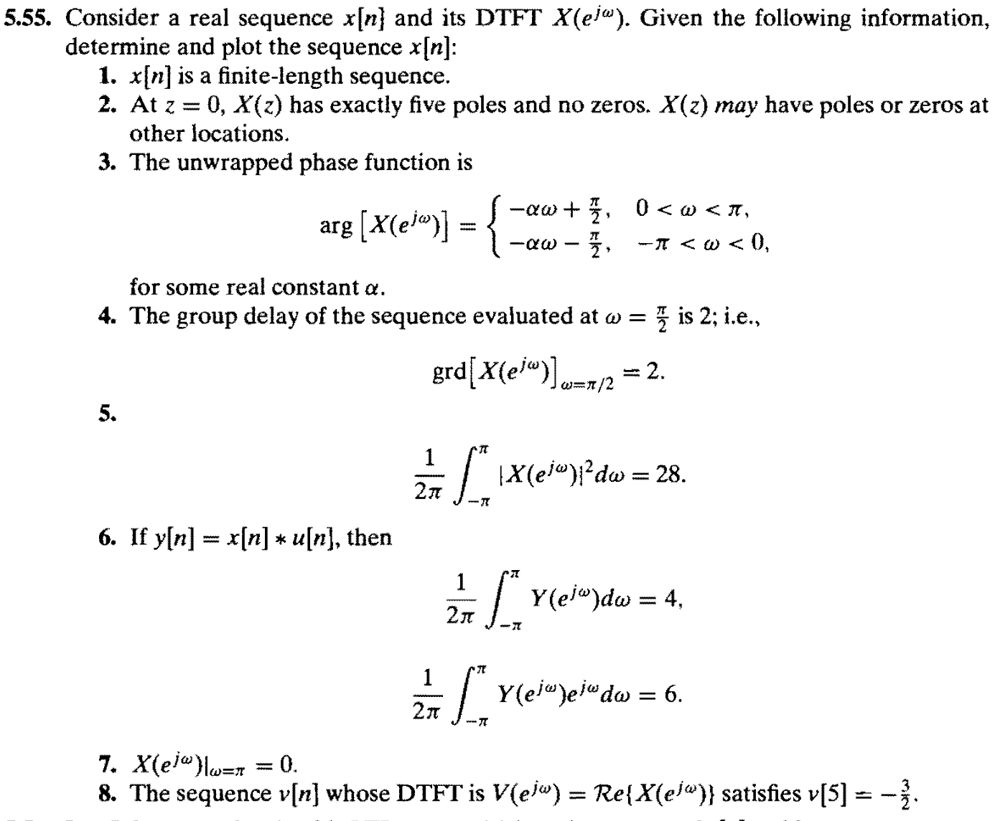

- [最小相位系统](#最小相位系统)
  - [性质](#性质)
  - [零极点性质](#零极点性质)
- [最大相位系统](#最大相位系统)
- [4类FIR线性系统](#4类fir线性系统)
- [更广泛的线性相位](#更广泛的线性相位)
- [实值响应](#实值响应)
- [幅度响应对应的零极点特性$C(z)$](#幅度响应对应的零极点特性cz)
- [全通系统](#全通系统)
  - [性质](#性质-1)
- [从给出的性质 求 序列](#从给出的性质-求-序列)
- [共轭倒数](#共轭倒数)
  - [线性相位系统 和 全通系统 的区别](#线性相位系统-和-全通系统-的区别)
# 最小相位系统
零极点都在单位圆内。
## 性质
一下几个对比都是对于具有相同幅度相应的序列而言的，即  在$C(z)=H(z)H^*(\frac{1}{z^*})$中，按照共轭对称的原则 选取不同组的零极点得到的$H(z)$

1. 最小相位滞后
2. 最小群延迟
3. 最小能量延迟$\displaystyle \sum_{r=0}^M\lVert h[m]\lVert^2\le \sum_{r=0}^M\lVert h_{min}[m]\lVert^2, \forall M\ge 0$

## 零极点性质
1. 零相位系统的所有零极点都以 共轭倒数 的形式成对出现；
2. 线性相位系统是在 零相位 的基础上，在$0,\infty,{\color{red}{}\pm 1}$处有额外的零/极点。
# 最大相位系统

# 4类FIR线性系统
- 零点分布：
  - 在**实值**条件下，有：如果$z_0$是零点，那么
    $$z_0^*,z_0^{-1},(z_0^*)^{-1}$$
    都是零点。他们互为**共轭倒数**。
- 极点分布：
  - 极点都在原点————想一想就知道了……

# 更广泛的线性相位
零极点也是成 共轭倒数
非实值响应的话，零、极点以共轭倒数对形式出现；
实值响应的话，还以共轭形式出现
> 可以 由 1 推 4     
> IMPORTANT：所以其实就是一个频域为 实值的响应+时移：*对称性*更进一步的说应该是$h[n]=h^*[M-n]$
# 实值响应

零点/极点**共轭**出现：
如果$z_0$是零点，那么$z_0^*$也是零点。

# 幅度响应对应的零极点特性$C(z)$
如果$z_0$是$H(z)$的零点，那么$C(z)$中另一个零点是$\dfrac{1}{z_0}$.即：

零点对 互为共轭倒数；极点对 也互为共轭倒数。

（ATTENTION:事实上只有全通系统是“零极点”互为共轭倒数；而线性相位系统和幅度响应都是“零点和零点”、“极点和极点”）

表达式
$$
|H(e^{j\omega})|^2\Rightarrow C(z)\\
C(z) = H(z)H^*\left(\dfrac{1}{z^*}\right)
$$

# 全通系统
在**实值响应**条件下，其零点也是成 共轭倒数对 出现的。
$$
H_{ap}(z)=\dfrac{z^{\color{red}{-1}}-a^*}{1-az^{-1}}\dfrac{z^{\color{red}{-1}}-a}{1-a^*z^{-1}}
$$
> 其零极点**共轭倒数**
> 可以 由 1 推 4

## 性质
群延迟$\operatorname{grd}[H(\rm e^{j \omega})]\ge 0$
# 从给出的性质 求 序列
DSP 5.55

- [ ] 难点在于条件3.中的相位跳变：    
***相位跳变表明在$z=\pm 1$处有零点***

# 共轭倒数
首先，$z_1,z_2$互为共轭倒数的来源和$s$域的共轭对称是一个意思；在图形上表现出来就是：

- $s$域：$z_1=-z_2^*\Rightarrow \sigma_1+\operatorname{j}\omega_1=-\sigma_2+\operatorname{j}\omega_2$。即关于虚轴对称；
- $z$域：$z_1=\dfrac{1}{z_2^*}\Rightarrow{r_1{\rm e}^{j \omega_1}=\dfrac{1}{r_2}{\rm e}^{j \omega_2}}$。即关于单位圆成共轭倒数。

## 线性相位系统 和 全通系统 的区别
- 全通系统：***零点 与 极点 成共轭倒数***
- 线性相位系统：***零点 与 零点（或 极点 与 极点）成共轭倒数***

全通系统需要的是幅度为1，类比$s$域的情况，如果零点和极点关于虚轴对称，自然有 幅度为1

TODO
IMPORTANT
> 这里面提到的线性相位系统的性质都是基于这个线性相位是以对称性为前提的；即：有没有那种没有对称性但是仍然线性相位的系统呢？值得思考