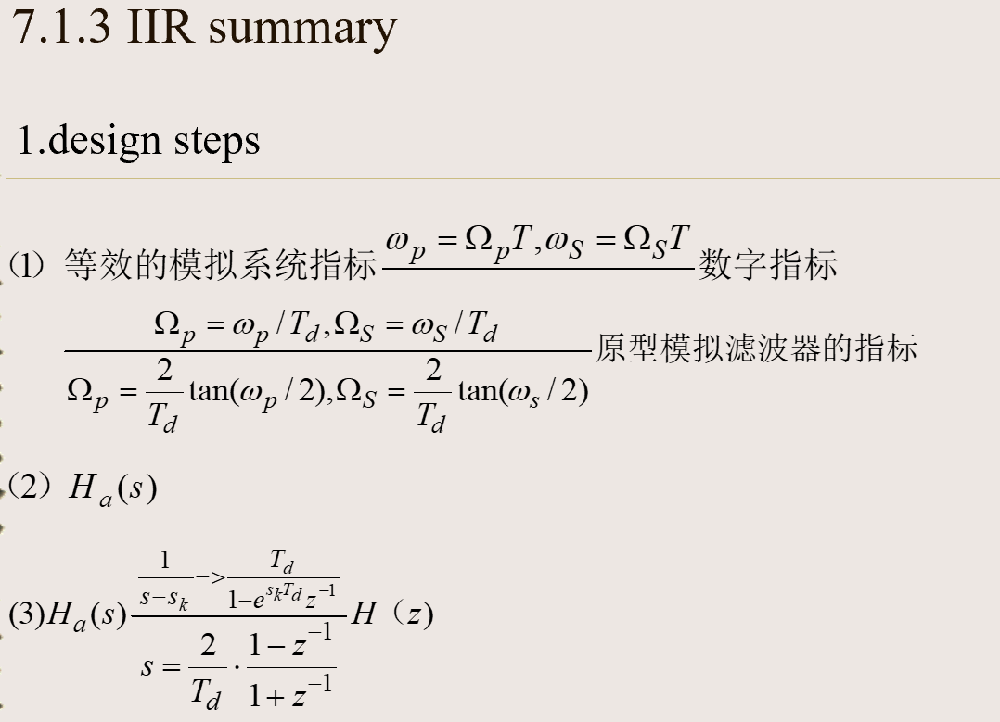
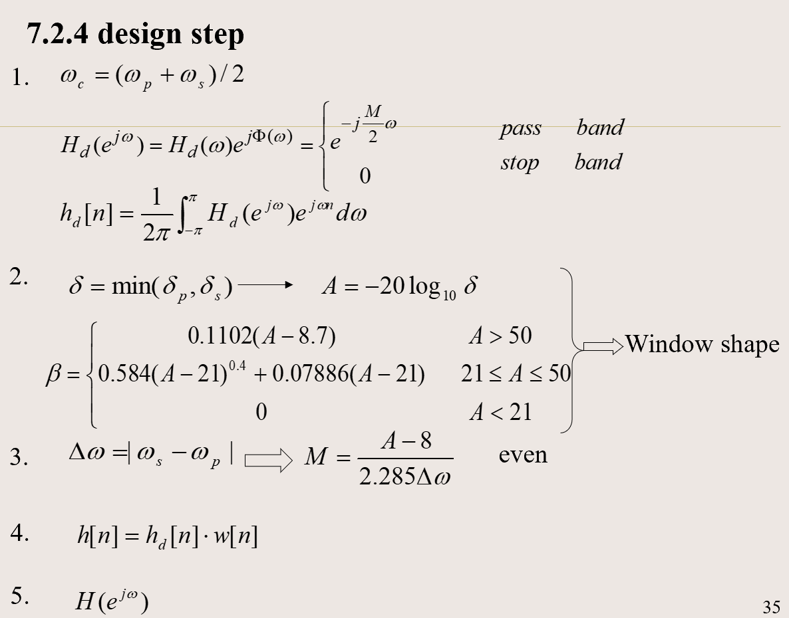

# IIR 滤波器

## 冲激响应不变
常用：
$$
\displaystyle\frac{1}{s+a} \leftrightarrows \dfrac{\color{red}{}T}{1-e^{-aT}z^{-1}}
$$

ATTENTION：冲激响应不变有一个常数因子：$H(e^{j\omega})=H_c(j\dfrac{\omega}{T})\Rightarrow h[n]={\color{red}T}h_c(nT)$

## 双线性变换
IMPORTANT

**背**！

$s\leftrightarrows z$:
$$
s=\dfrac{2}{T}\left(\dfrac{1-z^{-1}}{1+z^{-1}}\right)\\
\qquad\\
z=\dfrac{1+(T/2)s}{1-(T/2)s}
$$

$\omega \leftrightarrows \Omega$:
$$
\Omega = \dfrac{2}{T}\tan{\dfrac{\omega}{2}}
$$

## Summary

# FIR 线性相位滤波器

1. 首先，FIR不一定都是线性相位的。如果要是线性相位的，充分条件是`四种线性相位FIR`：即冲激响应具有一些对称性。
2. 窗函数也要有对称性，即**所需的冲激响应和窗函数都具有对称性质**
   $$
   \begin{aligned}
   &h_d[n]=\dfrac{1}{2\pi}\int_{-\infty}^{\infty}H_d(e^{j\omega}){\rm d}\omega\\\hline
   &h_d[n]=h_d[M-n],&n\in{[\infty,\infty]}\\
   &w[n]=w[M-n]    &n\in{[0,M]}
   \end{aligned}

    $$
    其中$H_d(e^{j\omega})$具有理想的低通或者某种**理想**性质。（所以是无穷长的冲激）

## 设计流程
