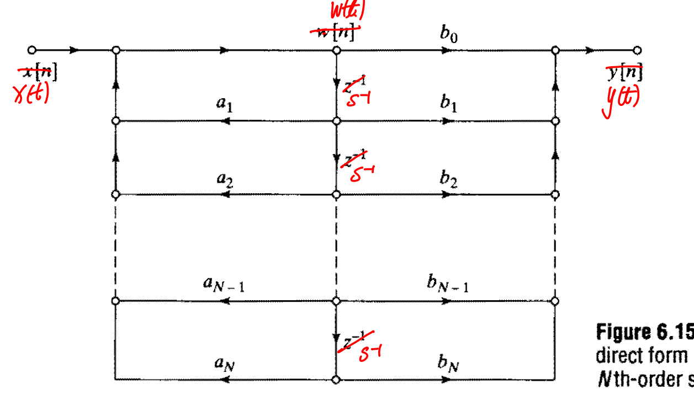
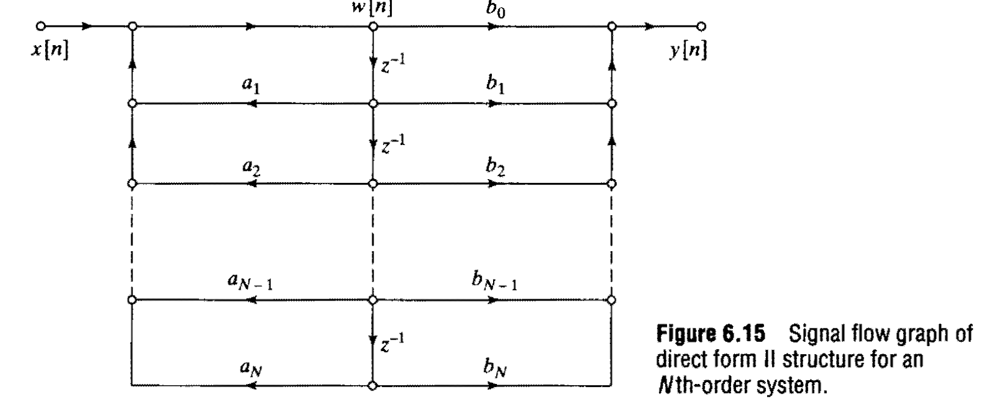

就是画信号流图

包括直接型，级联型，并联型

# S
响应的格式（！很重要）：
$$
H(s)=\frac{\displaystyle\sum b_ks^{-k}}{1{\color{red}-}\displaystyle\sum a_l s^{-l}}
$$
## 直接型

# Z
响应格式：
$$
H(z)=\frac{\displaystyle\sum b_kz^{-k}}{1{\color{red}-}\displaystyle\sum a_l z^{-l}}
$$
## 直接型
