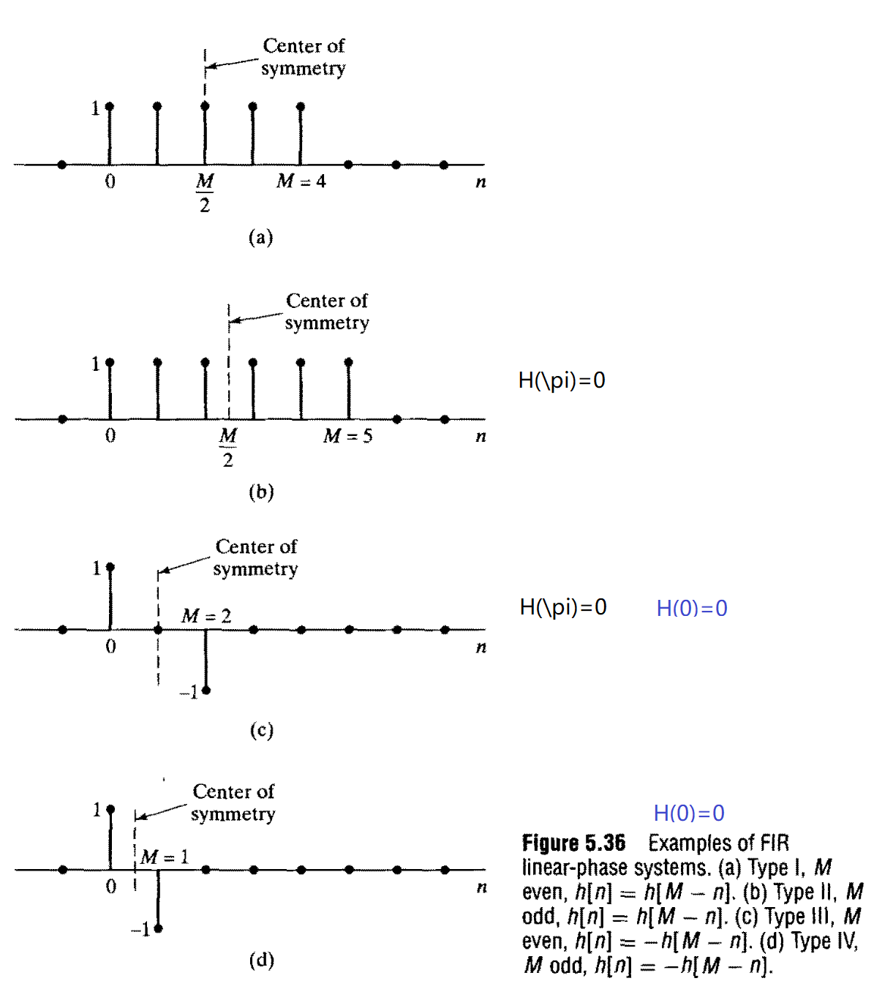

# TODO 几种响应
## 自由响应 强迫响应
## 稳态响应 暂态响应 

# 画图：常见零极点分布对应的频率响应
## Laplace
### 

## Z

# 常见变换对
求反变换很有用
## Z
$$
\dfrac{az^{-1}}{(1-az^{-1})^2}\Leftarrow na^nu[n]
$$
## Laplace
$$
\dfrac{1}{(s-a)^2}\Leftarrow t{\rm e}^{at}u(t)
$$

## 滤波器与窗函数
1. 矩形窗
   1. 离散
   $$
   \operatorname{DTFT}\left[\begin{cases}
       1,&0\le n\le M\\0,&otherwise
   \end{cases}\right]
   =\dfrac{\sin{(M+1)\omega/2}}{\sin{\omega/2}}e^{-jM/2}
   $$
   2. 连续
   $$
    \operatorname{CTFT}\left[\begin{cases}
        1,&|t|<t_c\\0,&otherwise
    \end{cases}\right]=\dfrac{2\sin \omega t_c}{\omega}
   $$
2. 低通滤波器
   1. 离散
   $$
   \displaystyle
   \operatorname{DTFT}\left[\dfrac{\sin{\omega_cn}}{\pi n}\right]=\begin{cases}
     1&,|\omega|<\omega_c\\
     0&,otherwise
   \end{cases}
   $$
   1. 连续
   $$
   \operatorname{CTFT}\left[\dfrac{\sin{\omega_c t}}{\pi t}\right]=\begin{cases}
     1&,|\omega|<\omega_c\\
     0&,otherwise
   \end{cases} 
   $$
    
# 四类线性FIR
首先这只是四种特殊情况：

#