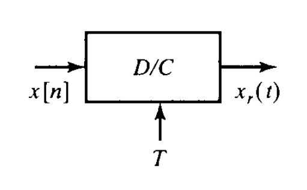
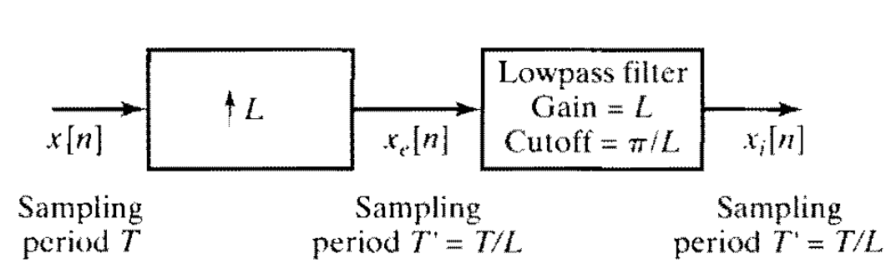
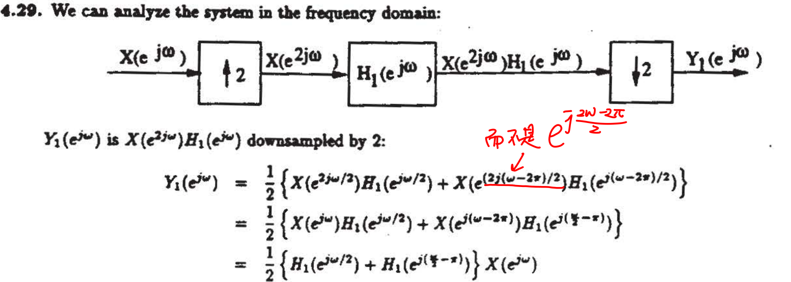

# 增采样
## 时域
分两步：

$$
x_e[n]=\begin{cases}
    x[n/L]&,n=L,2L,...\\
    0&,others
\end{cases}
\tag{1}
$$
第二步：**内插**，得到的最终时域表达为
$$
x_i[n]=x_c(nT/L)\tag{2}
$$
就相当于用$T/L$的间隔去采样的效果一样
## 频域
$$
\tag{1}
X_e(e^{j\omega})=X(e^{jL\omega})
$$
经过增益为$L$，截止频率为$\pi/L$的LPF
$$
\tag{2}
X_i(e^{j\omega})=LX(e^{jL\omega})\quad{\color{red}{\omega<|\pi/L|}}
\overset{DTFT}{\xLeftarrow{}}x_c(nT/L)
$$

ATTENTION：
1. 第一步还没有经过滤波器的频域只是进行了$\omega$轴的压缩，只有经过了第二步内插（经过增益为$L$的低通滤波器）才会变成$DTFT(x_c(nT/L))$.不像减采样直接就能得到对应的频域表达式
2. 内插操作：很像抽样的**恢复**，经过一个滤波器，增益为$L$，截止频率为$\pi/L$.

ATTENTION 在题目中，采样的$D/C$的图中自带了滤波器，但是增采样没有自带滤波器，包括减采样也没有事先经过滤波器

# 减采样
只有一步
## 时域
$$
x_d[n]=x[Mn]
$$
## 频域
$$
X_d(e^{j\omega})=\frac{1}{M}\sum_{r=1}^{M-1}X(e^{j\frac{\omega-2\pi r}{M}})
$$
ATTENTION：

只考虑了$-\pi$到$\pi$的部分，如果有混叠，则周围的会影响到最终结果

# 总结
基本来说就是：

时域扩展，频域压缩 且 增益变大（就好像变瘦变高）

时域压缩，频域扩展 且 增益变小（变胖变矮）

---

另外，最容易出错的地方就是增采样还没有进行内插的时候，这个式子经常在后面的章节出现，比如：   
DSP8.37

ATTENTION：频域的变化（平移和压扩）是对$\omega$讨论的，这意味着：将$X(e^{\operatorname{j}\omega})$看作$f(\omega)$.    
例如：

# DTFT
卷积过程：
可以先计算$x(t)*h(t)$再进行抽样；即使有混叠也一样