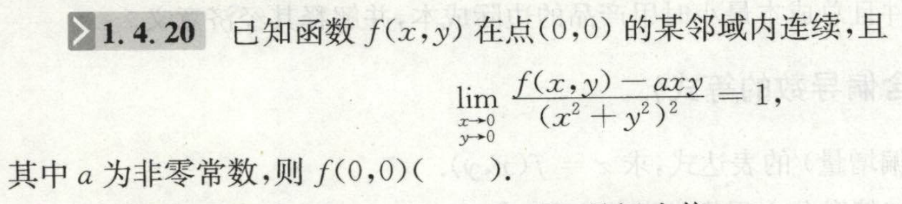

张宇 闭关修炼
# 极限
1. :
   
   

   
答案

   36.
   

2. $\displaystyle\lim_{x\rightarrow0}(f(x)-g(x)h(x))$，其中$f(x)$和$g(x)$趋于常数$c$，而$h(x)\rightarrow 1$。此时能将$h(x)$用1替换吗？
   

   
答

   
   不能.
   

3. TODO 单调递减的函数$f(x)$，$x_{n+1}=f(x_n)$，则如何求极限?
   
   ex:
4. :
5. :
# 中值定理不等式证明
1. ：
    并不是常见的“两次泰勒”的方式！这个题两次泰勒应该是做不出来的。

# 多元微分

问题是：$f(0,0)$是否是极值点

利用对称性判断是否是极值点