1. 
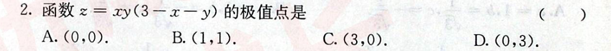
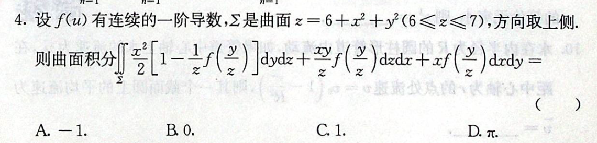

2. 

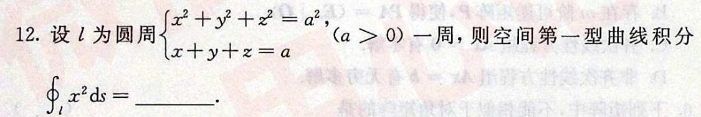
3. 
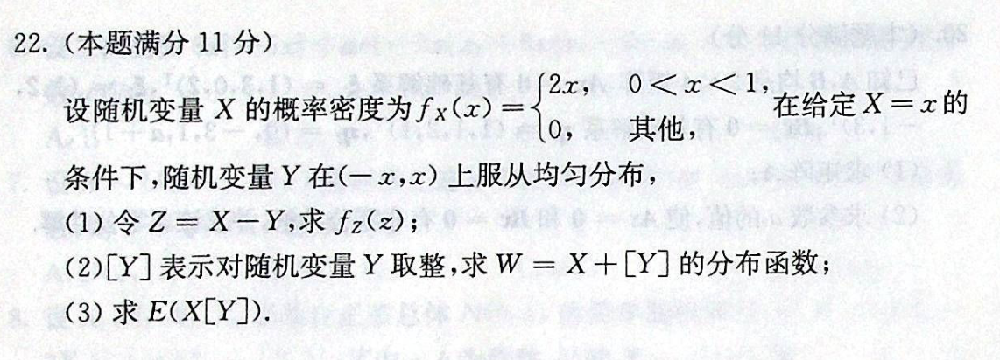
4. 
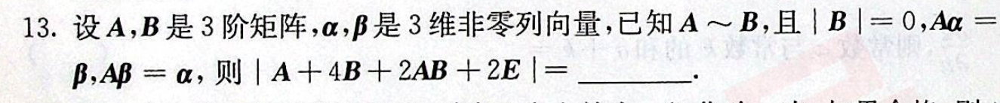

5. 

ans

$M<N<P$

比大小的问题两种方法：
1. 中值定理
2. 转化成 三角形、正方形等图形的面积

ans

$7^nn!$

7. 难计算
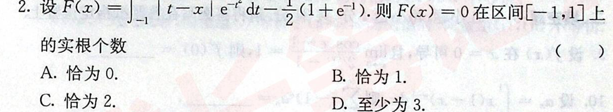

定积分 重点

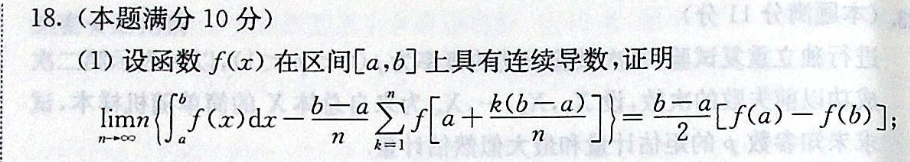

ans

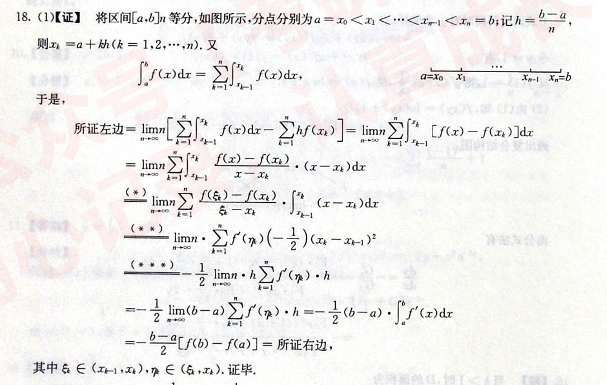

巧用一类曲线积分的定义

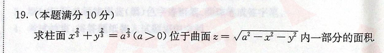

8. 偏导的计算：$y'=-\dfrac{F_1'}{F_2'}\Rightarrow y''=-\dfrac{(F_{11}''{\color{red}{+F_{12}''y'}})F_2'-(F_{21}''{\color{red}{+F_{22}''y'}})F_1'}{(F_2')^2}$

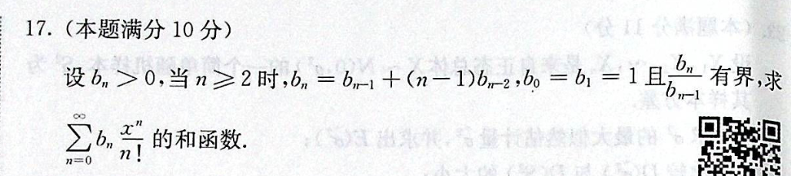
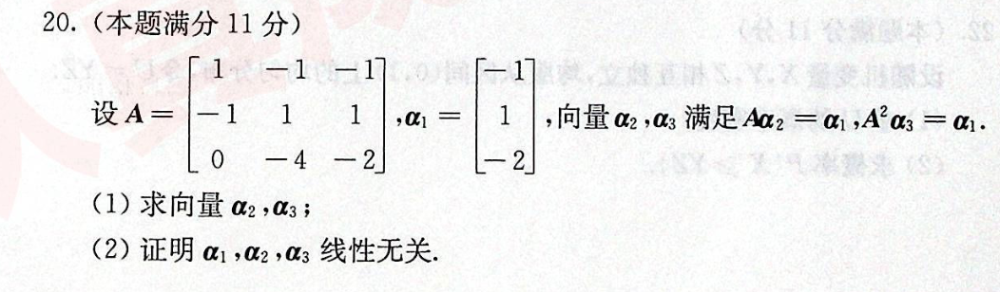

# 真题
### 2014
1.  设数列$a_n,b_n$满足$0<a_n,b_n<\dfrac{\pi}{2}$，$\cos a_n-a_n=\cos b_n$，已知级数$\displaystyle\sum b_n$收敛.   

    求证：级数$\displaystyle\sum\dfrac{a_n}{b_n}$收敛.

    

    
详解

    关键一步：$\displaystyle\lim\dfrac{a_n}{b_n^2}=\lim\dfrac{a_n}{1-\cos b_n}\cdot\dfrac{1-\cos b_n}{b_n^2}$

    本题的经验

    “隐函数”$F(a_n,b_n)=0$的形式，要想求极限，需要借助类似的方法；[类似的题](https://github.com/JoeyRxy/code/tree/master/markdown/数分/题目技巧.md#L117)

    

### 2010
1. 设$m,n$是正整数，则反常积分$\displaystyle\int_0^1\dfrac{\sqrt[m]{\ln^2{(1-x)}}}{\sqrt[n]{x}}{\rm d}x$的收敛，则$m,n$的取值范围。
   

   
ans

   
   $m,n\in N^+$

   尤其是$0$处的判别。十分有技巧性
   

