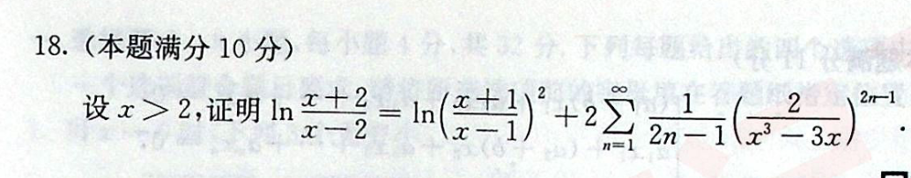
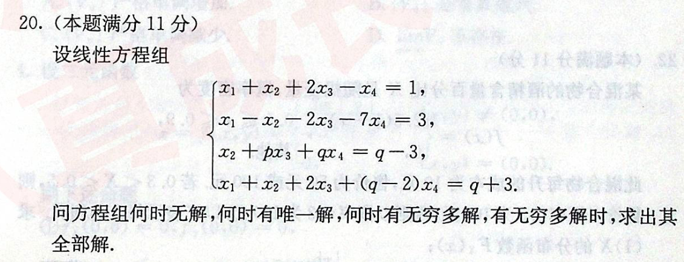
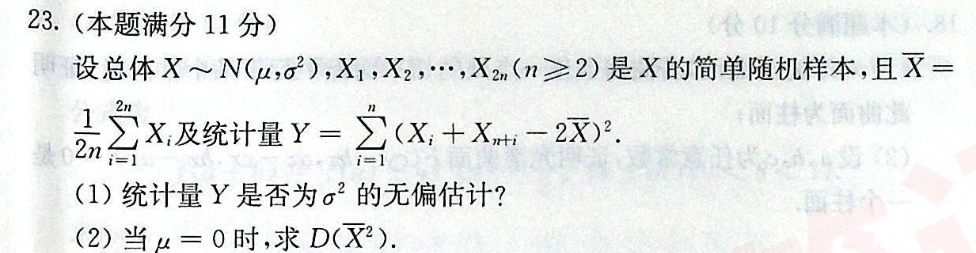

1. 

2. 

3. 

4. 

5. 

ans

$M<N<P$

比大小的问题两种方法：
1. 中值定理
2. 转化成 三角形、正方形等图形的面积

ans

$7^nn!$

# 真题
### 2014
19. 设数列$a_n,b_n$满足$0<a_n,b_n<\dfrac{\pi}{2}$，$\cos a_n-a_n=\cos b_n$，已知级数$\displaystyle\sum b_n$收敛.   

    求证：级数$\displaystyle\sum\dfrac{a_n}{b_n}$收敛.