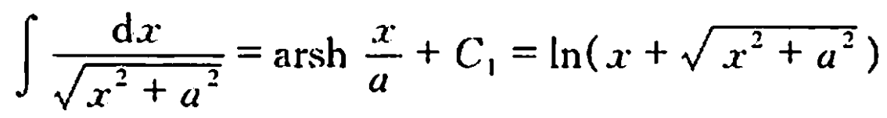
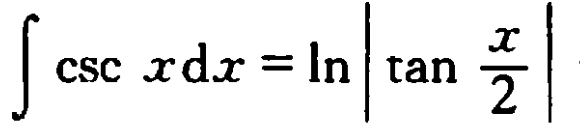
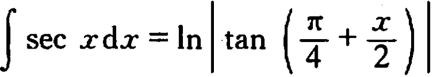
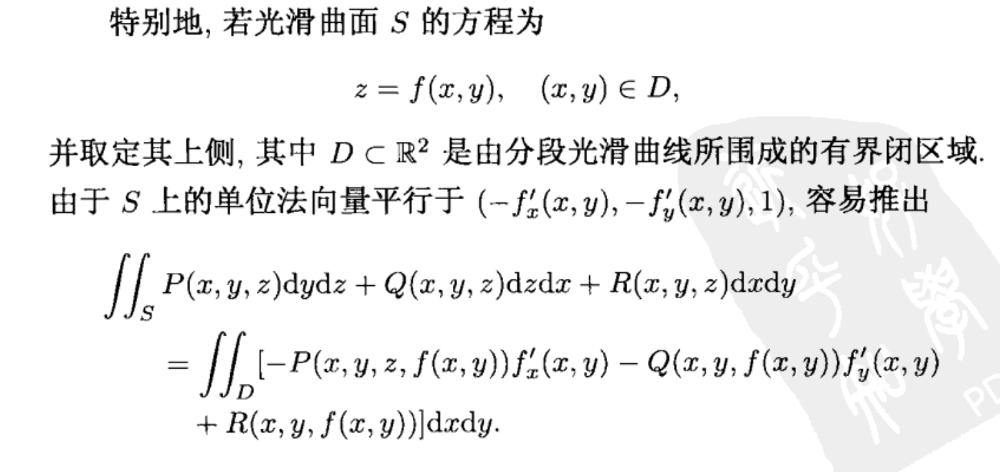
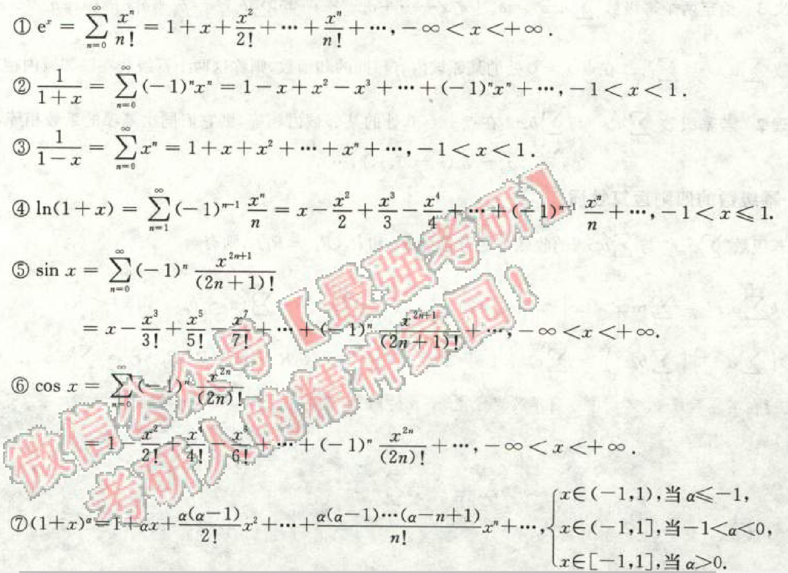
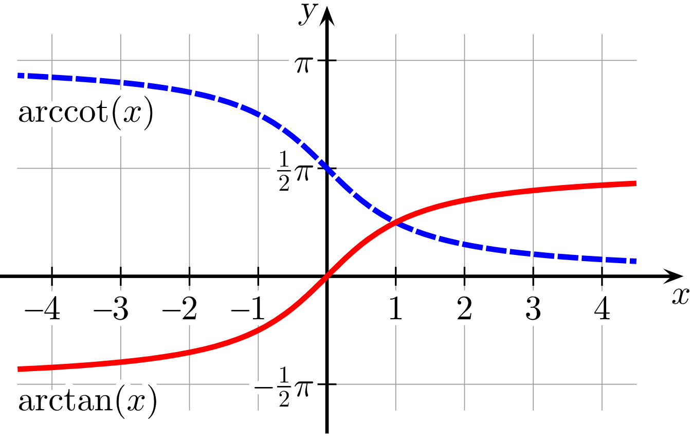
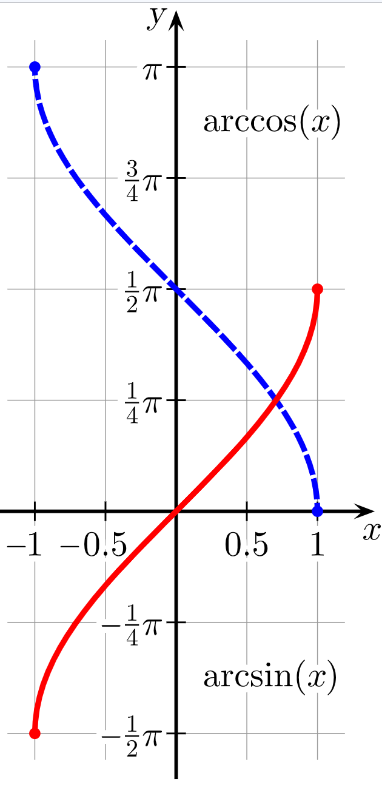

# 微分
## 曲率公式
$$
K = \dfrac{|y''|}{(1+y'^2)^{\frac{3}{2}}}
$$

## 总是记错的导数
1. $(\arcsin x)'=\dfrac{1}{\sqrt{1-x^2}}$，而由于$\arccos$和$\arcsin$的和为常数，所以他们的导数**互为相反数**

# 积分
## 三角函数
1.  
$$
\int_0^{\pi/2} \sin^n{x} {\rm d}x=\begin{cases}
    \dfrac{(n-1)!!}{n!!}&,n=2k+1\\
    \\
    \dfrac{(n-1)!!}{n!!}\dfrac{\pi}{2}&,n=2k
\end{cases}
$$
2. 
3. 
4.    

    怎么记这个？由$\cos(x)=\sin(x+\frac{\pi}{2})$，直接$\csc x$的结果里的$x\rightarrow x+\frac{\pi}{2}$即得.
5. 

# 重积分
## 部分球面的面积和体积
 一个*张角*为$\varphi_0$的球体的一部分，其占整个球体的百分比为$\dfrac{1-\cos{\varphi_0}}{2}$

> 张角：球面坐标系中的第三个参数$\varphi$

即：
1. 表面积为$2\pi R^2(1-\cos{\varphi_0})$
2. 体积为$\dfrac{2\pi R^3}{3}(1-\cos{\varphi_0})$

# $\arcsin x和\arccos{x}$
定义域：$[-\pi/2,\pi/2]$和$[0,\pi]$

# 曲面积分和曲线积分
## 第二型曲面积分的计算
### 方法一：公式计算

若并不特殊（应该不会考），见伍胜建 第三册 P216
### 方法二：补面/挖空法并利用高斯通量定理

# 泰勒级数

## 使用条件
IMPORTANT

- 佩亚诺余项：$f(x)$在$x_0$处有$n$阶导数，则可以展开到$\dfrac{f^n(x_0)}{n!}$项
- 拉格朗日余项：$f(x)\in C^n[a,b]$，其中$C^n I$表示在$I$上的，有$n$阶**连续**导数的函数的集合，即：$f^{(n+1)}(x)$**不仅存在，而且连续**。

# 常微分方程
## 一阶方程 常数变易法
方程： $y'+p(x)y=q(x)$

解：

$y=\displaystyle e^{\displaystyle {\color{red}{-}}\int p(x)dx}\left[\displaystyle\int e^{\int p(x)dx}\cdot q(x)dx+C\right]$

# 反三角函数

1. 连续可导：导函数连续