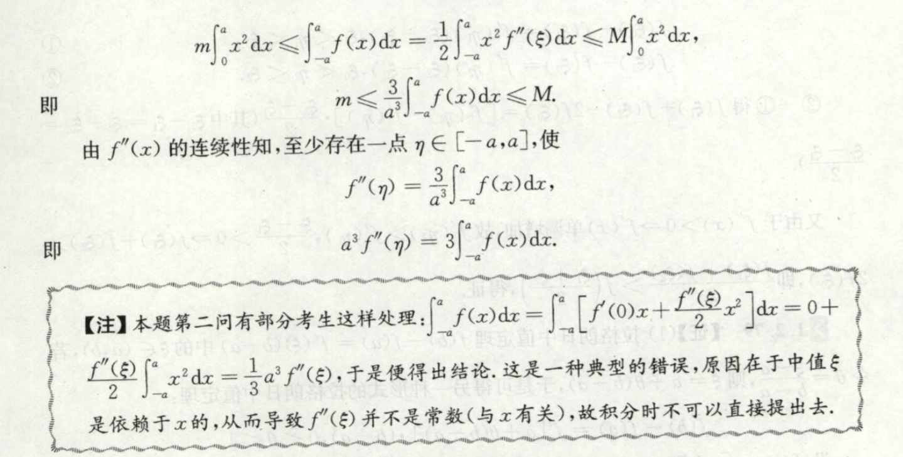

- [函数，极限，连续](#函数极限连续)
  - [复合函数的泰勒展开 求极限](#复合函数的泰勒展开-求极限)
    - [方法一](#方法一)
    - [非常重要!$\colorbox{yellow}{important}$](#非常重要$\colorbox{yellow}{important}$)
  - [不定式极限 技巧总结](#不定式极限-技巧总结)
  - [两个题目](#两个题目)
- [数列](#数列)
  - [数列收敛的判别准则](#数列收敛的判别准则)
    - [1. 单调有界](#1-单调有界)
    - [2. 夹逼定理](#2-夹逼定理)
    - [3. 定义](#3-定义)
    - [4. 收敛数列的任意子数列也收敛](#4-收敛数列的任意子数列也收敛)
    - [5. Cauchy收敛原理](#5-cauchy收敛原理)
    - [6. 维尔斯特拉斯](#6-维尔斯特拉斯)
- [级数的收敛](#级数的收敛)
  - [1、正项级数](#1正项级数)
    - [1、比较判别法](#1比较判别法)
      - [1、一般形式](#1一般形式)
      - [2、极限形式](#2极限形式)
    - [2、比值判别法](#2比值判别法)
    - [3、根值判别法](#3根值判别法)
    - [4、 抽象函数 证明收敛](#4-抽象函数-证明收敛)
  - [幂级数的收敛半径](#幂级数的收敛半径)
  - [幂级数的展开](#幂级数的展开)
    - [先积后导](#先积后导)
    - [先导后积](#先导后积)
  - [幂级数的和函数](#幂级数的和函数)
    - [先积后导](#先积后导-1)
    - [先导后积](#先导后积-1)
- [广义积分和瑕积分](#广义积分和瑕积分)
    - [定积分也能求极限！！！](#定积分也能求极限)
  - [介值定理](#介值定理)
  - [$\varepsilon-\delta$语言的使用](#varepsilon-delta语言的使用)
  - [极限的乘法除法](#极限的乘法除法)
- [中值定理](#中值定理)
  - [$\colorbox{yellow}{IMPORTANT}$ 常用的构造](#$\colorbox{yellow}{important}$-常用的构造)
    - [在和式形式时：找前后两项中能够构成求导关系的式子，即为$f(x)$，在$f(x)$的剩余函数即为$\varphi(x)$。使用公式$(\operatorname{e}^{\varphi(x)})'=\operatorname{e}^{\varphi(x)}(f(x)\varphi'(x))+f(x)$](#在和式形式时找前后两项中能够构成求导关系的式子即为fx在fx的剩余函数即为varphix使用公式operatornameevarphixoperatornameevarphixfxvarphixfx)
    - [含有高阶项时](#含有高阶项时)
      - [商的形式：$[\ln(y)]''=(\dfrac{y'}{y})'$.即：分子是分母的导数](#商的形式lnydfracyy即分子是分母的导数)
      - [积的形式：$[\dfrac{1}{2}y^2]''=(yy')'$.即：一个式子内部的一部分是另一部分的导数](#积的形式dfrac12y2yy即一个式子内部的一部分是另一部分的导数)
  - [积分中值定理](#积分中值定理)
    - [$f''(\xi)$的积分如何处理](#fxi的积分如何处理)
- [积分技巧](#积分技巧)
  - [换元技巧](#换元技巧)
  - [含有周期函数的定积分判断正负](#含有周期函数的定积分判断正负)
- [对称性](#对称性)
  - [在重积分里经常使用](#在重积分里经常使用)
- [曲线和曲面积分](#曲线和曲面积分)
  - [第二型曲面积分](#第二型曲面积分)
    - [原始方法](#原始方法)
      - [分别在各自平面计算](#分别在各自平面计算)
      - [最常用（参数化）](#最常用参数化)
    - [高斯公式](#高斯公式)
    - [与一型曲面的联系](#与一型曲面的联系)
  - [第二型曲线积分](#第二型曲线积分)
  - [原始方法](#原始方法-1)
  - [斯托克斯公式](#斯托克斯公式)
  - [易错点](#易错点)
- [不等式](#不等式)
  - [积分不等式](#积分不等式)
- [解析几何的简便方法](#解析几何的简便方法)
  - [直线束](#直线束)
  - 
- [多元微分](#多元微分)

# 函数，极限，连续
1. 在不定式极限中，能不能混合应用洛必达和泰勒展开？

    可以

    例如：$\displaystyle\lim_{x\rightarrow0}\left(\dfrac{\displaystyle\int_{0}^x\sin{(x-t)^2}{\rm d}t}{\sin^2{x}\ln{(1-x)}}\right)$
    
    对于本题的分母，可以先将其利用泰勒展开化为$-x^3+o(x^4)$，分子可以先利用换元法$t = x-u$将其化为：$\displaystyle\int_{0}^x\sin{u^2}{\rm d}u$.   
    但是接下来我们需要考虑是否可以直接上下洛必达法则，因为**对于含有积分的不定式**，应当使用洛必达。**但是**，疑问来了，**能不能在分母使用了泰勒展开之后接着使用洛必达呢**，答案是可以。

    

    
ans

    
    这样，原式化为$\displaystyle\lim_{x\rightarrow0}\left(-\dfrac{1}{3}\dfrac{\sin{x}^2}{x^2}\right)=-\dfrac{1}{3}.$
    
    

    实验一下，这题有点秀：
    $$
    \displaystyle\lim_{x\rightarrow0^+}\dfrac{x^x-(\sin{x})^x}{x^3}
    $$
    

    
ans

    
    $\displaystyle\dfrac{1}{6}$
    
    

2. 除了上述这个貌似是对的方法是真的对，其他一些“歪门邪道”都是错的。例如：
   1. 将积分用**积分中值定理**先化简，然后再使用洛必达whatever……WRONG!往往会出现系数不对
   2. 先将积分号内的式子用泰勒公式展开，然后对多项式进行积分就很容易，…………这个的话，还不确定，见下一个：
3. 变上限积分的泰勒展开。
   
   其实还是上面那个问题。如果能够较快的展开变上限积分，上面的提就好做了。

    情况1. $\displaystyle\int_{x_0}^xf(t){\rm d}t$

    情况2. $\displaystyle\int_{x_0}^xf(x,t){\rm d}t$

    淦！实际上是可以用泰勒展开的（**不论是上边哪种情况**），只要你记住一个关键的条件：展开的点，牢牢记住，验证你是在哪个点展开的！

    如1.里的例题，分子里的$\displaystyle\int_{0}^x\sin{(x-t)^2}{\rm d}t$，上边之所以说不能直接展开，是因为我**展开错了**——在$t=0$展开当然不行了！得在$t=x\Rightarrow(t-x)=0$处展开才行啊，弟弟……

    $\sin{(x-t)^2}\sim{}(x-t)^2+o((x-t)^2)$积分后为$\displaystyle\dfrac{1}{3}x^3$，直接与分母相除可得答案……

> 所以，综上所述，“几大问题，一个对策”：统统使用泰勒展开肯定能做，但是未必简单就是了
## 复合函数的泰勒展开 求极限
题目： 已知$f'(0)=0,f''(0)=4$，求$\displaystyle\lim_{x\rightarrow0}\dfrac{f(x)-f[\ln{(1+x)}]}{x^3}$

### 方法一
使用泰勒展开求出分子的阶数

### 非常重要!$\colorbox{yellow}{important}$
$$
\begin{aligned}
 & \dfrac{f(x)-f[\ln{(1+x)}]}{x^3}\\ \\
=&\dfrac{f(x)-f[\ln{(1+x)}]}{\color{red}{x-\ln[1+x]}}\cdot \dfrac{\color{red}{x-\ln[1+x]}}{x^3}
\end{aligned}
$$

## 不定式极限 技巧总结
1. 及时将***因式***提出：因式！不是和或差；***凑非0因式***
   1. 在$0-0$中，提出一些公因式，如果非0，则可以先计算
   
   例子：
   $\dfrac{x^x-(\sin{x})^2}{x^3}$

   0-0不好计算，先将$x^x$提出，由于其极限为1，故先将其计算

2. 含有***多个根号***时 => 换元
3. 中值定理 ，往往容易出错，使用夹逼定理证明一下更加严谨

## 两个题目

答案

---
# 数列
## 数列收敛的判别准则
### 1. 单调有界
### 2. 夹逼定理
### 3. 定义
$$
\forall \varepsilon>0,\exists N\in{\mathbb{N}^+},\forall n>N,|a_n-A|<\varepsilon
$$
### 4. 收敛数列的任意子数列也收敛
$\forall \{a_{n_k}\}, \displaystyle\lim_{k\rightarrow\infty}a_{n_k}=\lim_{n\rightarrow\infty}a_n$

常用来证明数列不收敛$\Rightarrow$找到一个不收敛的子列来证明原数列不收敛，或者两个收敛到不同值的子列来证明原数列不收敛

### 5. Cauchy收敛原理
是考纲吗？

### 6. 维尔斯特拉斯
有界数列必有收敛子列

貌似不常用

# 级数的收敛

## 1、正项级数

### 1、比较判别法

#### 1、一般形式

设两个正项级数$\displaystyle\sum _{n=1}^{\infty }a_{n}$和${\displaystyle \sum _{n=1}^{\infty }b_{n}}$，且${\displaystyle \exists N,s.t. n>N ,\underline{{\color{red}{c}}\cdot a_{n}\leqslant b_{n}}}$：

如果级数${\displaystyle \sum _{n=1}^{\infty }b_{n}}$收敛，则级数$\displaystyle\sum _{n=1}^{\infty }a_{n}$收敛；

如果级数$\displaystyle\sum _{n=1}^{\infty }a_{n}$发散，则级数${\displaystyle \sum _{n=1}^{\infty }b_{n}}$发散。

#### 2、极限形式

$$
\displaystyle\lim_{n\rightarrow\infty}\dfrac{a_n}{b_n}=\rho=\begin{cases}
  \infty&,如果b_n发散，则a_n发散\\
  (0,\infty)&,同敛散\\
  0&,如果b_n收敛，则a_n收敛
\end{cases}
$$

### 2、比值判别法

与比较判别法的极限形式不同的是，**自己和自己比**

$\displaystyle\lim_{n\rightarrow \infty}\dfrac{a_{n+1}}{a_n}=\rho$

$1)\rho>1$发散

$2)\rho<1$收敛

$3)\rho=0$无法判断

### 3、根值判别法

### 4、 抽象函数 证明收敛
方法：比较判别法的（非极限形式）

这种题一般已知条件里会有一些极限形式，利用 极限的定义 或者 有界性 的性质，可以得到一个关系式

然后利用 比较判别法的非极限形式，很容易得到结果

---
## 幂级数的收敛半径
除了比值的方法，更为牛逼的方法是：

$$
\rho = \lim_{n\rightarrow\infty} \sup{\sqrt[n]{|a_n|}}
$$
$R=\dfrac{1}{\rho}$就是半径

注意，上文中是系数序列$|a_n|$的上极限哦！

例题：
$$
\sum\frac{(3+(-1)^n)^n}{n}x^n
$$
利用这个定理是再好不过：应该求上确界的极限而不是极限（这里极限根本不存在）

## 幂级数的展开
### 先积后导
### 先导后积
题目：1800：p123:32
$$
f(x)=\arctan{\frac{1+x}{1-x}}在x_0=0处展开.
$$

> ATTENTION:注意一件事：$f(g(x))$在$x_0$展开，意味着$f(t)$在$t=g(x_0)$展开

## 幂级数的和函数
除了直接套公式，也可以用：
### 先积后导
### 先导后积

题目：
$$
\sum_{n=0}^\infty \dfrac{(-1)^nx^{2n}}{(2n)!!}的和函数
$$

答案

# 广义积分和瑕积分

---
### 定积分也能求极限！！！

## 介值定理
《1800》：P98:42.2

对于连续函数$f(x)$，
1. 闭区间$[a,b]$上有最大值，最小值
2. 如果$f(c)<m<f(d)$，则存在$\xi\in[c,d],s.t.f(\xi)=m$.

## $\varepsilon-\delta$语言的使用
其实就是一阶逻辑推演。

- 记得可以将$\forall$转化成某一个$x_0$!!

## 极限的乘法除法

四则运算的前提是各“分极限”存在，但是不要因为有这个条件、怕出错就不敢用这个性质啊……

- 例子：

$$
\displaystyle\lim_{n\rightarrow\infty}\left(\sum_{k=1}^{n}\dfrac{\sqrt{1+\cos{\dfrac{k\pi}{n}}}}{n+\dfrac{1}{k}}\right)
$$

ans

  本题要用夹逼定理和定积分求极限。

  缩小的时候只需将分母变成$n$即可。

  放大的时候，需要将分母换成$n+1$，但是就不能直接使用定积分求极限了。怎么办？

$$
  \dfrac{1}{n+1}\Rightarrow\dfrac{1}{n}\dfrac{n}{n+1}
$$
  利用乘法公式，$\dfrac{n}{n+1}$极限是1，而前者是有极限的，所以直接就解决了问题！

  所以不要忘了极限的 **分步计算**，或者四则运算

# 中值定理

[一篇文章][link]

1. 将要证明的式子整理为 $\phi(x)=0$ （一般不包含分式），然后令$F'(x)=\phi(x)$ ，对两边式子分别积分，则有$F(x)=\displaystyle\int \phi(t){\rm d}t$，那么F(x)就是我们所求的辅助函数。

2. 将所证明的表达式$\varphi(f'(\xi),f(\xi),\xi)=0$看成是微分方程，从中求解$f(x)$，然后忽略掉常数项就是我们要找的辅助函数了。
   (可能和第一种差不多啊)

3. 除了积分出原式来，还有一些包括两个函数的式子，需要考虑乘除法以及结合指数函数。其中一些见下图

- 罗尔定理构造：
- 

[一些题目](https://zhuanlan.zhihu.com/p/68900103)

- 双中值：使用两次中值定理，

[link]:https://zhuanlan.zhihu.com/p/33271753

## $\colorbox{yellow}{IMPORTANT}$ 常用的构造

- $e^xf(x)$：指数是常常用到的辅助函数
- $f(x)+f'(x)\quad\Rightarrow\quad (e^xf(x))'$

找什么特征？
### 在和式形式时：找前后两项中能够构成求导关系的式子，即为$f(x)$，在$f(x)$的剩余函数即为$\varphi(x)$。使用公式$(\operatorname{e}^{\varphi(x)})'=\operatorname{e}^{\varphi(x)}(f(x)\varphi'(x))+f(x)$
### 含有高阶项时
#### 商的形式：$[\ln(y)]''=(\dfrac{y'}{y})'$.即：分子是分母的导数
#### 积的形式：$[\dfrac{1}{2}y^2]''=(yy')'$.即：一个式子内部的一部分是另一部分的导数
## 积分中值定理

需要注意的就是中值定理不仅仅是$b-a$的形式。

另外，注意是$g(x)$是不变号
### $f''(\xi)$的积分如何处理

中值$\xi$是关于$x$的函数，不能直接提出来积分！

见下

# 积分技巧

## 换元技巧
1. $t=e^{x}$
2. $t=\displaystyle\dfrac{1}{\sqrt{x}}\qquad or \quad t=\sqrt{x}$

ex.:

$$
  \displaystyle\int\dfrac{1}{\sqrt{e^x-1}}{\rm d}x
$$

## 含有周期函数的定积分判断正负

ex.:

  $\displaystyle\int_{0}^{\sqrt{2\pi}}\sin{x^2}{\rm d}x$

# 对称性
## 在重积分里经常使用

# 曲线和曲面积分
## 第二型曲面积分
### 原始方法
#### 1) 分别在各自平面计算
$$
\iint_\Sigma P{\rm d}x{\rm d}y=\pm \iint_{D_{xy}}P{\rm d}x{\rm d}y
$$
注意到，这里是不用乘什么$\cos\alpha$之类的系数的
#### 2) 最常用（参数化）
针对参数化曲线：
$
\Sigma:\begin{cases}
  x=x(u,v)\\
  y=y(u,v)\\
  z=z(u,v)
\end{cases}
$
或**退化版**
$
\color{red}\begin{cases}
  x=x\\y=y\\z=z(x,y)
\end{cases}
$
$$
\begin{aligned}
  &\iint_\Sigma P{\rm d}y{\rm d}z+Q{\rm d}x{\rm d}z+R{\rm d}x{\rm d}y\\
=&\pm\iint_{D_{uv}}\left(P\dfrac{\partial(y,z)}{\partial(u,v)}+Q\dfrac{\partial(z,x)}{\partial(u,v)}+R\dfrac{\partial(x,y)}{\partial(u,v)}\right){\rm d}u{\rm d}v\\
对于退化版=&{\color{red}\pm\iint_{D_{xy}}\left[P(-z_x')+Q(-z_y')+R\right]{\rm d}x{\rm d}y}
\end{aligned}
$$
考研只考退化版

> 不过 仍要注意的是：上述雅可比行列式的顺序问题：$\dfrac{\partial(z,x)}{\partial(u,v)}$的$z,x$的顺序不能换，因为*对于行列式，减缓两行位置会多一个负号*.

ATTENTION：
选择投影平面时，应注意：
- 投影时不重合
- 正负号要根据方向选择
### 高斯公式
这个比较简单
### 与一型曲面的联系
记住向量，注意***负号***即可：$\cos\alpha=\dfrac{{\color{red}{-}}z_x'}{\sqrt{z_x'^2+z_y'^2+1}}$
$$
\begin{aligned}
  &\iint_\Sigma P{\rm d}y{\rm d}z+Q{\rm d}x{\rm d}z+R{\rm d}x{\rm d}y\\=&\iint_\Sigma (P,Q,R)\cdot(\cos\alpha,\cos\beta,\cos\gamma){\rm d}S\\考研直接对应到退化版=&\color{red}\iint_{D_{xy}}(P,Q,R)\cdot(-z_x',-z_y',1){\rm d}x{\rm d}y
\end{aligned}
$$
## 第二型曲线积分
## 原始方法
直接换参数，很简单
## 斯托克斯公式
1.直接化为一型曲面 或 2.直接化到参数化的二型曲面

$$
\begin{aligned}
  &\int_LPdx+Qdy+Rdz\\
  直接化为一型=&\pm\iint_\Sigma\left|\begin{matrix}
    \cos\alpha&\cos\beta&\cos\gamma\\
    \partial_x&\partial_y&\partial_z\\
    P&Q&R
  \end{matrix}\right|dS\\
  直接使用退化版=&\color{red}{}\pm\iint_\Sigma\left|\begin{matrix}
    -z_x'&-z_y'&1\\
    \partial_x&\partial_y&\partial_z\\
    P&Q&R
  \end{matrix}\right|dS
\end{aligned}

$$

## 易错点

！！容易忽略被积函数和其散度都必须是**连续函数**，不连续点要挖掉

# 不等式
1. 上/下限变量化
2. 如果有$f''(x)\ge 0$的条件，可以利用***泰勒***得出一个不等式（貌似可以用第一个方法代替啊……

## 积分不等式
1. 利用特殊点，往往有可能这个特殊点就是某个定积分……；然后做泰勒展开
   1. 
   2. 

# 解析几何的简便方法
## 直线束
## 

# 多元微分
题目：1800

ATTENTION：
$x$并不是完全等于$u$的。实际上等于号只是一个函数关系。

答案

