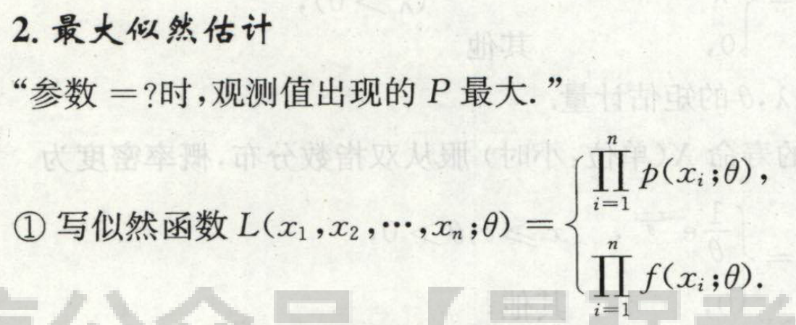
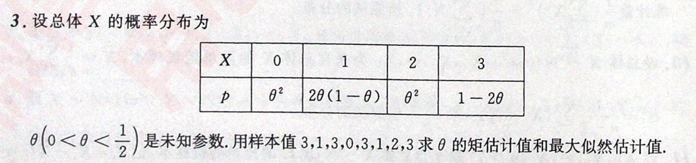

- [比较难算所以要记住的一个公式](#比较难算所以要记住的一个公式)
- [三大抽样分布](#三大抽样分布)
  - [卡方$\chi^2$分布](#卡方chi2分布)
    - [定义](#定义)
    - [上侧$\alpha$分位点:](#上侧alpha分位点)
    - [性质](#性质)
      - [可加性](#可加性)
      - [$E(X)=n,D(X)=2n$](#exndx2n)
  - [$t$分布](#t分布)
    - [定义](#定义-1)
    - [性质](#性质-1)
  - [$F$分布](#f分布)
    - [定义](#定义-2)
    - [性质](#性质-2)
      - [$F\sim{F(n,m)}\Rightarrow\dfrac{1}{F}\sim{F(m,n)}$](#fsimfnmrightarrowdfrac1fsimfmn)
      - [$F_{1-\alpha}(n,m)=\dfrac{1}{F_{\alpha}(m,n)}$](#f_1-alphanmdfrac1f_alphamn)
- [正态总体的样本 de 函数 de 均值和方差的分布](#正态总体的样本-de-函数-de-均值和方差的分布)
  - [$\quad \overline{X}\sim{N(\mu,\dfrac{\sigma^2}{\color{red}{}n})}$](#quad-overlinexsimnmudfracsigma2colorredn)
  - [$\quad\displaystyle \dfrac{1}{\sigma^2}\sum_{i=1}^{n}(X_i-\mu)^2\sim{\chi^2(n)}$](#quaddisplaystyle-dfrac1sigma2sum_i1nx_i-mu2simchi2n)
  - [$\quad\displaystyle \dfrac{(n-1)S^2}{\sigma^2}=\dfrac{1}{\sigma^2}\sum_{i=1}^{n}(X_i-\overline{X})^2\sim{\chi^2(n-1)}$](#quaddisplaystyle-dfracn-1s2sigma2dfrac1sigma2sum_i1nx_i-overlinex2simchi2n-1)
  - [$\quad\displaystyle \dfrac{\overline{X}-\mu}{S/\sqrt{n}}\sim{t(n-1)}$](#quaddisplaystyle-dfracoverlinex-mussqrtnsimtn-1)
  - [$\quad \overline{X},S^2$互相独立](#quad-overlinexs2互相独立)
- [点估计](#点估计)
  - [最大似然估计：竟然忘了好几次，**多记忆，多练习**](#最大似然估计竟然忘了好几次多记忆多练习)
    - [最大似然估计的**不变性**](#最大似然估计的不变性)
- [区间估计](#区间估计)
  - [步骤](#步骤)
- [假设检验](#假设检验)
- [关于计算](#关于计算)

# 比较难算所以要记住的一个公式
我们知道$D(X)=E((X-EX)^2)=EX^2-(EX)^2$，同样在统计里也有类似的公式，有可能会用到，就是
$$
\displaystyle \dfrac{1}{n} \sum_{i=1}^n(X_i-\overline{X})^2=
\dfrac{1}{n}\sum_{i=1}^nX_i^2-(\overline{X})^2
$$

# 三大抽样分布
**相互独立永远是前提。**

## 卡方$\chi^2$分布
### 定义
如果随机变量$X_1,X_2,...,X_n$**相互独立**，且服从**标准正态分布**$N(0,1)$，则随机变量$X=\displaystyle{\sum_{i=1}^nX_i^2}$服从参数为$n$的卡方分布，记作
$X\sim{\chi^2(n)}$

### 上侧$\alpha$分位点:
$\displaystyle P(X>\chi^2_\alpha(n))=\alpha$
> 注意： 不具有对称性。而正态分布和t分布就具有对称性

### 性质
#### 可加性
**独立**前提下，$X_1+X_2\sim{\chi^2(n_1+n_2)}$
> 这是很显然的，本来卡方分布就是平方和嘛

这条性质实际上主要为了为求期望和方差做准备：如下
#### $E(X)=n,D(X)=2n$

---

## $t$分布
### 定义
如果一个服从正态，一个服从卡方，就服从$t$分布。

$X\sim{N(0,1)},Y\sim{\chi^2(n)}$，两者**相互独立**，那么随机变量$\displaystyle t\sim{\dfrac{X}{\sqrt{Y/n}}}$服从自由度为$n$的t分布。

### 性质
概率密度函数关于y轴中心对称。

---

## $F$分布
### 定义
两个卡方分布的商

$X\sim{\chi^2(n)},Y\sim{\chi^2(m)}$，且两者相互独立，那么$\displaystyle F=\dfrac{X/n}{Y/m}$服从自由度为$(n,m)$的F分布。

### 性质
> 不满足对称性哦！

#### $F\sim{F(n,m)}\Rightarrow\dfrac{1}{F}\sim{F(m,n)}$
#### $F_{1-\alpha}(n,m)=\dfrac{1}{F_{\alpha}(m,n)}$

# 正态总体的样本 de 函数 de 均值和方差的分布
主要用途：
- 区间估计的 枢轴量
- 无偏估计 可 由此推出
- 假设检验

$X_1,X_2,...,X_n$来自正态总体$N(\mu,\sigma^2)$的样本

|                                           | 枢轴量                                                           |     |
| ----------------------------------------- | ---------------------------------------------------------------- | --- |
| 估计均值$\hat{\mu}$，知道方差$\sigma^2$   | $\dfrac{\overline{X}-\mu}{\sigma/{\color{red}{}\sqrt{n}}}$       |     |
| 估计均值$\hat{\mu}$，不知道方差$\sigma^2$ | $\displaystyle \dfrac{\overline{X}-\mu}{S/\sqrt{n}}$             |     |
| 估计方差$\hat{\sigma}$，知道均值$\mu$     | $\displaystyle \dfrac{1}{n}\sum_{i=1}^{n}(X_i-\mu)^2$            |     |
| 估计方差$\hat{\sigma}$，不知道均值$\mu$   | $\displaystyle \dfrac{1}{n-1}\sum_{i=1}^{n}(X_i-\overline{X})^2$ |     |

## $\quad \overline{X}\sim{N(\mu,\dfrac{\sigma^2}{\color{red}{}n})}$

知道方差$\sigma^2$的时候，
1. $\hat{\mu}$区间估计的枢轴量可选取为$\dfrac{\overline{X}-\mu}{\sigma/{\color{red}{}\sqrt{n}}}$
2. 无偏估计为$\overline{X}$，因为$\operatorname{E}[\overline{X}]=\mu$

***易错***：均值的分布 的 方差 不要忘了除以n

## $\quad\displaystyle \dfrac{1}{\sigma^2}\sum_{i=1}^{n}(X_i-\mu)^2\sim{\chi^2(n)}$
即知道均值$\mu$的情况下，
1. $\hat{\sigma}$区间估计的枢轴量可以选取为$\displaystyle \dfrac{1}{\sigma^2}\sum_{i=1}^{n}(X_i-\mu)^2$
2. $\hat{\sigma}^2$的无偏估计是$\displaystyle \dfrac{1}{n}\sum_{i=1}^{n}(X_i-\mu)^2$

不过这个好像不常考。
## $\quad\displaystyle \dfrac{(n-1)S^2}{\sigma^2}=\dfrac{1}{\sigma^2}\sum_{i=1}^{n}(X_i-\overline{X})^2\sim{\chi^2(n-1)}$
即当不知道均值的时候，
1. $\hat{\sigma}^2$的区间估计枢轴量可以选取为$\dfrac{(n-1)S^2}{\sigma^2}$
2. $\hat{\sigma}^2$的无偏估计为$S^2$

## $\quad\displaystyle \dfrac{\overline{X}-\mu}{S/\sqrt{n}}\sim{t(n-1)}$
即不知道方差的时候
1. 均值$\mu$的区间估计枢轴量选取为$\dfrac{\overline{X}-\mu}{S/\sqrt{n}}$
2. $\mu$的无偏估计（仍然）是$\overline{X}$

## $\quad \overline{X},S^2$互相独立
**这都是要记忆的**，为什么，因为这个很难推导的，不可能在考场上推得出来
# 点估计
## 最大似然估计：竟然忘了好几次，**多记忆，多练习**

尤其是离散的情况：
题目：1800：P152:3

### 最大似然估计的**不变性**
如果$\hat{\theta}$是$\theta$的最大似然估计，且$g(\theta)$是**单调**函数$\Rightarrow$$g(\hat{\theta})$是$g(\theta)$的最大似然估计
# 区间估计
基本的方法其实都在[正态总体的样本-de-函数-de-均值和方差的分布](#正态总体的样本-de-函数-de-均值和方差的分布)小节里。

## 步骤
1. 置信度$1-\alpha$，比如说0.95，实际上的$\color{red}{\alpha=1-置信度}$是0.5.
2. 如何得到$P[\theta_1<\theta<\theta_2]=1-\alpha$.对于双边区间来说，应该是$[x_{1-\alpha/2},x_{\alpha/2}]$，对于正态分布和t分布来说，由于关于y轴对称，所以$x_{1-\alpha/2}=-x_{\alpha/2}$

# 假设检验

显著性水平$\alpha$，和置信度里的$\alpha$是一个东西。

# 关于计算

经常出现这样的参数估计题目：   
设$f(x)$是概率密度
$$
f(x)=\begin{cases}
    g(x)&,x\in(0,1)
    \\\\
    0,&,others
\end{cases}
$$

在最大似然估计参数的时候，需要分类讨论这些样本的范围；   
但实际上概率密度为0就意味着“不可能发生的事件”，所以就能判定所有样本的范围就是$(0,1)$.

