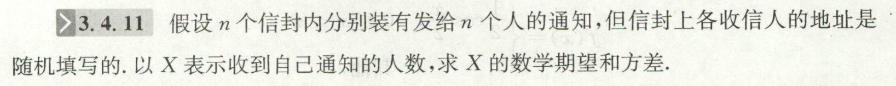

1.

2. 设有来自三个地区$A,B,C$的各10名、15名和25名报名表，其中女生报名表分别为3份、7份和5份。先随机抽一个地区，然后再从中抽取两份报名表。

   已知后抽到的一份为男生表的情况下，求先抽到的一份为女生表的概率

   

   
ans

   $\dfrac{20}{61}$
   

# 分解变量法求 数字特征
离散型

***通过引入 伯努利计数变量 的方法进行分解***

将总事件$X$分解为伯努利计数变量$X_i$.   
$\displaystyle X=\sum X_i$再利用期望和方差的性质即可

1. 来源：《闭门修炼》

1. 1800:p149:17

3. 1800：p150:7 

---
最大似然估计：来源：《闭门修炼》
