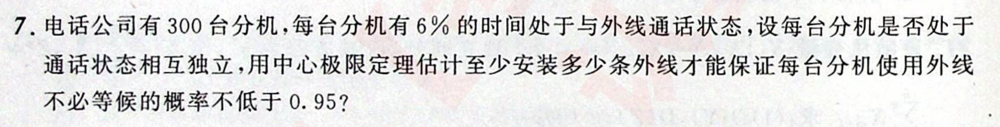

1.

2. 设有来自三个地区$A,B,C$的各10名、15名和25名报名表，其中女生报名表分别为3份、7份和5份。先随机抽一个地区，然后再从中抽取两份报名表。

   已知后抽到的一份为男生表的情况下，求先抽到的一份为女生表的概率

   

   
ans

   $\dfrac{20}{61}$
   

# 分解变量法求 数字特征
离散型

***通过引入 伯努利计数变量 的方法进行分解***

将总事件$X$分解为伯努利计数变量$X_i$.   
$\displaystyle X=\sum X_i$再利用期望和方差的性质即可

1. 来源：1800 P149 25

2. 1800:p149:17

---
最大似然估计：来源：《闭门修炼》

# 求分布
1800

# 期望
1. 1800：
某商店经销某种商品，每周进货数量$X$与该商品的需求量$Y$之间相互独立，且都服从$[10,20]$的均匀分布。
商店每售出一件商品，可获利1000元；若需求量超过供应量，可从其他商店调剂，这时每个商品获利500元。
求每周获利的期望。
   

   
答案

   
   

2. 1800:

   

   
答案

   连续函数离散化的典型

   按全概率分解 来计算即可
   

3. 1800:

   

   
答案

   
   

4. 1800：p150:7 

    

    
答案

    
    
    

5. 正态总体$X$，参数为$\mu,\sigma$，$X_1,...X_n$是$X$的样本，令$T=\displaystyle\sum_{i=1}^n(X_i-\overline{X})^2$。求$\operatorname{E}(X_1T)$
    

    
答案

    
    知识点：正态样本$S^2$和$\overline{X}$独立
    
    
    
