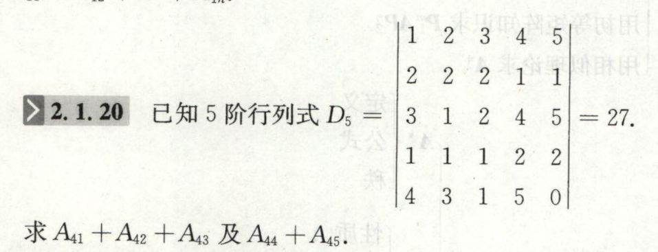
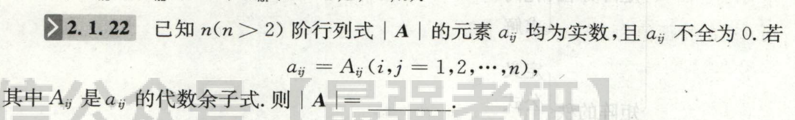
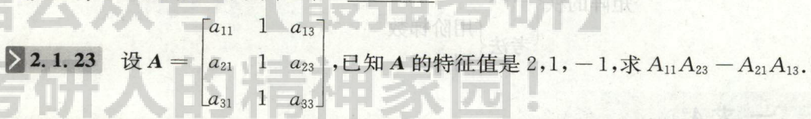
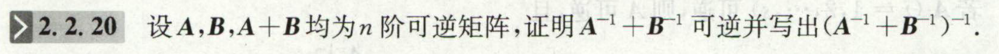
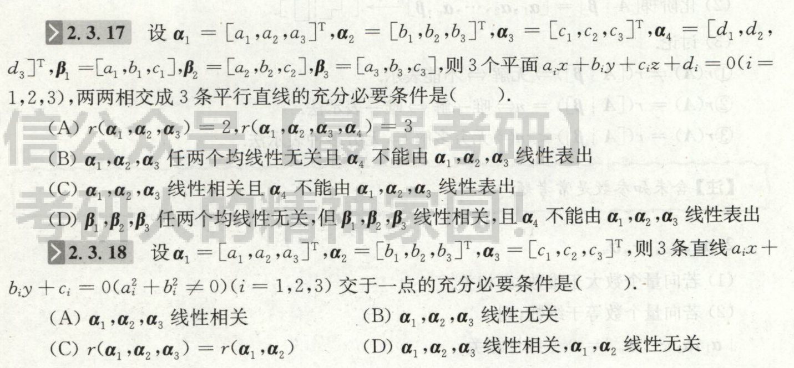
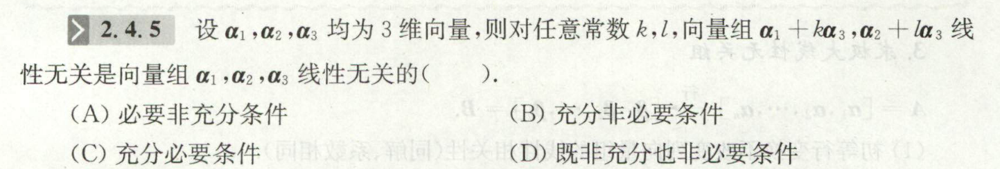
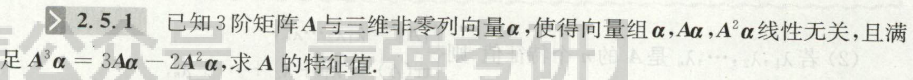
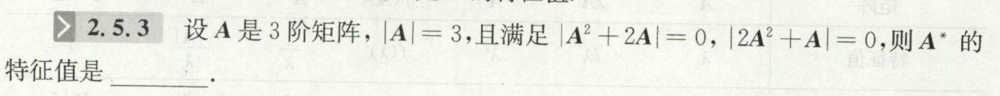
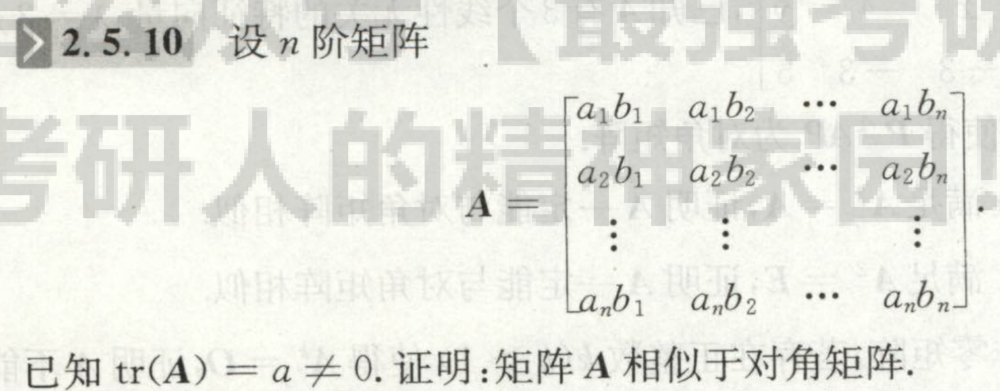
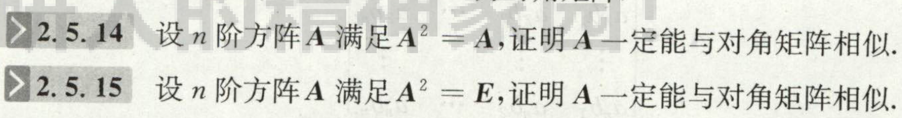

# 代数余子式
1. 是自带符号的
2. 只需和对应元素相乘 再 求和就得到行列式的值，不需考虑$-1$.

## 伴随矩阵
1. 求逆和求伴随可交换 ： $(A^*)^{-1}=(A^{-1})^*$
2. $E^*=E$
3. 特征值

## $A^*,A^{-1}$各种性质
|          | 数乘                           | 行列式                                                  |                            |
| -------- | ------------------------------ | ------------------------------------------------------- | -------------------------- |
| $A^*$    | $(kA)^*=k^{n-1}A^*$            | $\operatorname{det}(A^*)=[\operatorname{det}(A)]^{n-1}$ | $(A^*)^*=(\det(A))^{n-2}A$ |
| $A^{-1}$ | $(kA)^{-1}=\dfrac{1}{k}A^{-1}$ |                                                         |

# 逆

# 想清楚

# 相似

- 相似里 $\operatorname{tr}(A),\det(A)$的性质怎么考？
  - 已知部分特征值，然后求其他特征值的时候；这时候就要想到能不能利用迹和行列式性质了
  - 还可以判断相似，因为这两个是必要条件！判断相似前，完全可以花几秒钟简单计算一下，说不定就直接得到两个不相似了    
  - 再就是求参数

- 含有$E$的乘积的式子，有一个重要的特点：$A(A-E)\Rightarrow r(A)+r(E-A)\ge r(A+E-A)=r(E)=n \Rightarrow r(A)+r(A-E)=n$：$(E-aA)(E-bA)$的式子都要想到这个哦！

- ATTENTION 不同特征值的特征向量正交 的前提条件是：**实对称矩阵**

## 可对角化的证明
- 证明$A$是实对称矩阵
- 一般方法

# 二次型
## 基本变换法
步骤：
1. 将原二次型矩阵$G$和单位阵$E$放在一起
2. 对$G,E$作同一个**列**变换
3. 对$G$再单独做一次相同的**行**变换
4. 重复2-3步
5. 最后$E$变成的矩阵$P$，即为所需**过渡矩阵**

题目：
- $A,B$正定，$AB=BA$，证明：$AB$是正定矩阵.

# 基
基$(1)$到基$(2)$的过渡矩阵为$P$,即：$(2)=(1)P$
则
### 一、 同一个向量，$(1)$中的坐标$X$，和$(2)$中坐标$Y$ 的关系是$X=PY$
### 二、 同一个变换，$(1)$中的矩阵表达$A$，和$(2)$中的$B$ 的关系是$AP=PB$
### 三、 同一个二次型，$(1)$中的矩阵表达$A$，和$(2)$中的$B$ 的关系是$P^TAP=B$（类比上一个的 相似）

