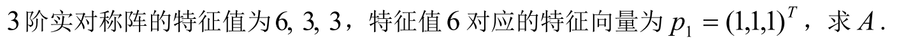

1. r(A)的另一个定义：A的所有阶子式中，不为0的最大阶数
2. f(A)的特征值为f($\lambda$)。注意常数项|I+A|
3. $A\sim B$==>Tr(A)=Tr(B) 且 det(A)=det(B)
4. 特征向量：定义==>非零
5. ***实对称***矩阵根据部分特征值求其他量
   1. 
   2. 主要定理：不同特征空间正交（!实对称矩阵）
6. $|\lambda E-A|=\lambda^n-tr(A)\lambda^{n-1}+(-1)^n\det{A}$ 求A中的一些未知数的题目很有用
7. 过渡矩阵、坐标变换、合同变换：
   
   $AT=B$

   $x=Ty$

   $T^T(A^TA)T=B^TB$
8. 化标准型的***两***种方法：
   1. 初等变换法：每次列变换$P$之后，进行一次相同的行变换$P^T$==>$P^TGP$
   2. 正交变换法

    > 如果是化***规范型***，只能是初等变换法
9. 证明矩阵正定的方法：
   1.  对于***抽象***矩阵：$\forall x\ne0,x^TAx>0$
   2.  $A\sim\Lambda$通过正交变换，可以化到I
   3.  顺序主子式>0
10. $r(x^Tx)=1$
11. 向量组的 无关和相关：
    1.  无关：等价于证明：$(\varepsilon_1,\varepsilon_2,...,\varepsilon_n)X=0\rightarrow X=0$
    2.  相关
        1.  向量组的秩 小于 向量个数（常常利用秩的不等式）
        2.  定理：(I)表出(II)，且(I)的向量个数 小于 (II)的，则(II)相关
12. 行列式的加法：$det(a_1,...,a_j+a_j',...,a_n)=det(a_1,...,a_j,...,a_n)+det(a_1,...,a_j',...,a_n)$-----按某一****行****分解
13. 分块矩阵 与 准对角矩阵
    1. 准***主对角***矩阵：
       1. 行列式$det(A)=\prod det(A_i)$
       2. 逆：$A^{-1}=\begin{pmatrix}
           A_1^{-1}&0\\
           0&A_2^{-1}
       \end{pmatrix}$主对角上各个矩阵求逆
    2. 准***次对角***矩阵：
       $A=\begin{pmatrix}
           0&A_1\\A_2&0
       \end{pmatrix}$
       1. $det(A)=(-1)^{n_{A_1}n_{A_2}}det(A_1)det(A_2)$
       2. $A_{-1}=\begin{pmatrix}
           0&A_2^{-1}\\
           A_1^{-1}&0
       \end{pmatrix}$注意！次对角颠倒了位置
14. n元方程$AX=b$有解的情况下，有n-r(A)+1个线性无关解，但是这些解不构成线性空间
15. 如何证明一个向量$\beta$可以由向量组(I)表出？两个条件：
    1.  (I)线性无关
    2.  (I,$\beta$)线性相关

    同时满足才行

    当然也有其他的方法，对于具体的问题，直接解方程可能更方便
16. 向量组等价的另一个判定：(I)表出(II)，且r(I)=r(II)，那么两个向量组等价   

    其他的判定定理：
    1. r(I)=r(II)=r(I,II)
    2. 互相表出
17. 正交变换的性质：
    1.  保持长度不变
    2.  保正交
    3.  由以上，标准正交基变换后仍然是标准 正交的

18. n阶矩阵A的秩和其非0特征值的个数相同（*k重根算作k个根*）——————错误！前提条件是必须可对角化！