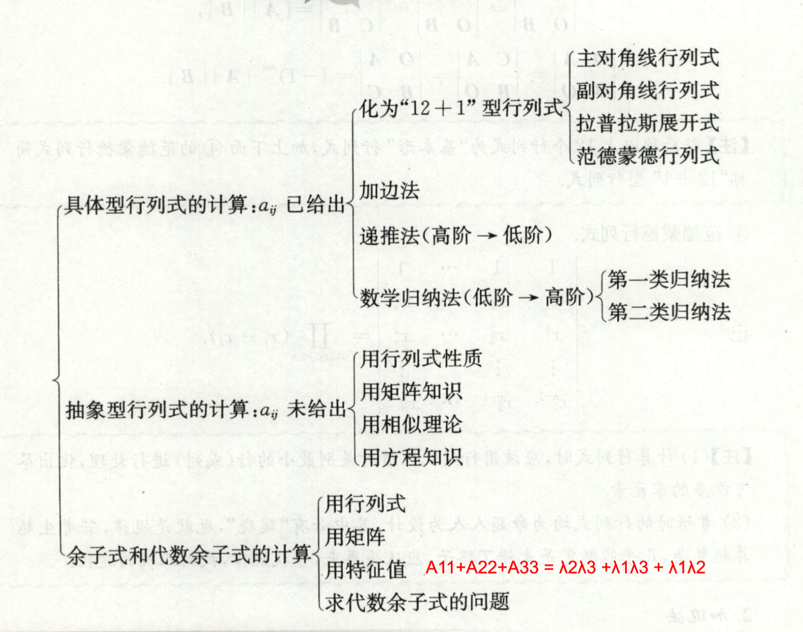
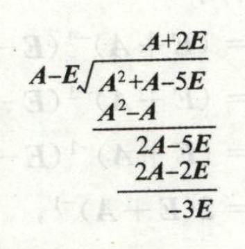
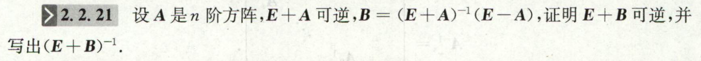
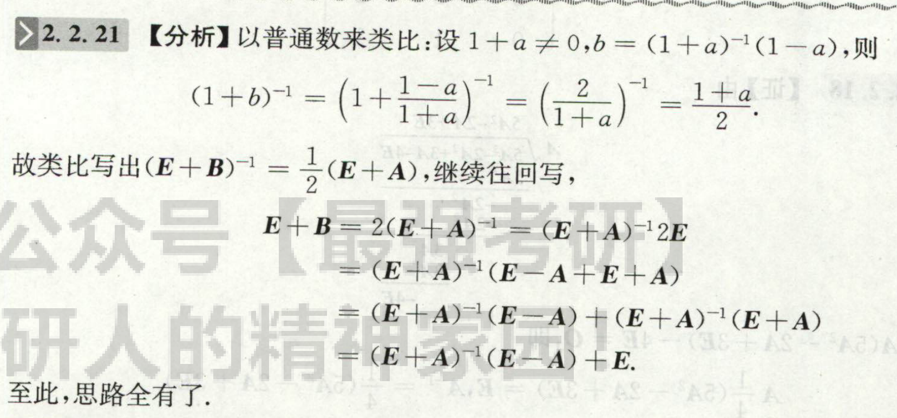

# 行列式

## 爪型 及其 变异型行列式
1. 递推
2. 把其他所有行加到第一行 以 化成三角形（而不是一般的用第一行加到其他行）

## $E+\alpha\alpha^T$

# 矩阵

## 逆矩阵
### 抽象型
1. 利用多项式除法，将A看作x，将E看作1

    

    
answer

    
    

2. 利用数（一阶矩阵）来类比

    

    
answer

    
    

3. $A^k=\bold{O}$

联想到：

$$
E^k-A^k=E
$$

4. r(A)=1

联想到：
$$
r(A)=1\Leftrightarrow A=\alpha\beta^T
$$

5. $E\pm\alpha\alpha^T$

# 向量组

## 公共解 子空间的交与和

### 1. 矩阵$A,B$解空间$U,V$的***交***$U\cap V$，是$A,B$行向量组的***和***$A+B$(构成的新矩阵$\displaystyle\begin{pmatrix}A\\B\end{pmatrix}$)的解空间

### 2. 求法
1. 如果矩阵方程是齐次的，即$\begin{cases}    AX=0\\BX=0\end{cases}$，那么方法有
   1. 联立法：$\begin{pmatrix}A\\B\end{pmatrix}X=0$，所求得的$X$即为结果.
   2. 分别求出两个解空间，并求两个解空间的***交***.
2. 如果两个方程组是非齐次的：$\begin{cases}AX=a\\BY=b\end{cases}$，那么公共解的求法不同：
   1. 联立法：$\begin{pmatrix}A\\B\end{pmatrix}X=\begin{pmatrix}a\\b\end{pmatrix}$，***基本一样***
   2. ~~解向量组（这时候不能称之为“空间”了）的交~~：*似乎不对，存疑，不用*
## 同解
### 1. 当方程组是齐次的时候$AX=0,BX=0$
1. ***行***向量组等价==>$r(A)=r(B)=r\begin{pmatrix}
    A\\B
\end{pmatrix}$
2. 

### 2. 方程组非齐次$AX=\alpha,BX=\beta$，方法好像大不一样
等价于：导出方程组$AX=0$和$BX=0$同解，且特解相同;

考虑非齐次方程组的求解过程：必然是化为***同一个***最简阶梯型 ，由于是通过***初等行变换***化为阶梯型，故我们得到下面的结论：
1. 增广矩阵的***行***向量组等价：$r(A|\alpha)=r(B|\beta)=r\begin{pmatrix}    A|\alpha\\B|\beta\end{pmatrix}$

# 相似
## 相似的性质（不一定非要可对角化）
1. r(A)=r(B)
2. $|A|=|B|$
3. tr(A)=tr(B)
4. 相同的特征值（即使不可对角化）