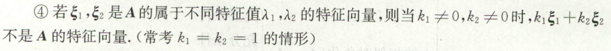

1. 实**对称**矩阵 -> 不同特征子空间**正交**
2. （由上）实**对称**矩阵 -> **正交**相似于对角阵

# 行列式
1. 行列式 任一行元素 和 其他行所对应的 代数余子式 相乘求和 为**0**！！
2. 范德蒙行列式
3. 

# 矩阵
1. 二阶矩阵的**逆** 计算：
 
    主对角对调，次对角取相反数

    然后除以行列式
2. 抽象矩阵证可逆：凑出$AB=I$

# 相似

1. $A^*$的特征值为$\frac{|A|}{\lambda}$，特征向量仍然是$A$的特征向量；注意：$A^T$的特征值也是$\lambda$，但是特征向量没有规律，需另求
2. 