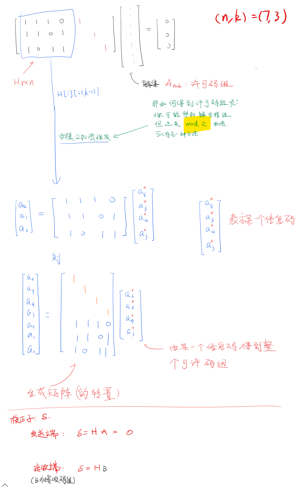
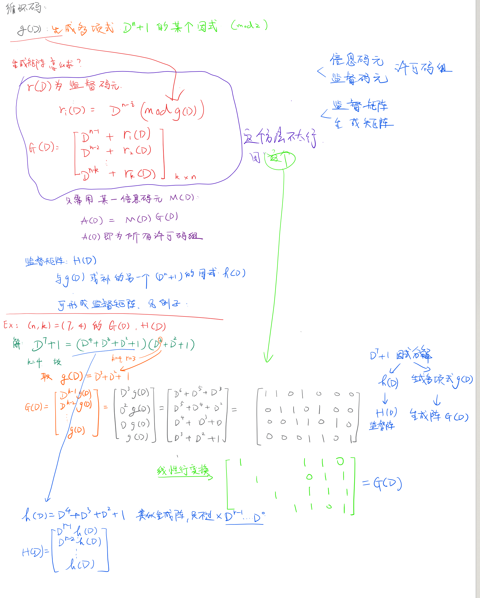

# 普通线性分组码

# 汉明码

# 循环码：

n位循环码，信息位为k，监督位为r。——`(n, k)`

- 生成多项式`g(D)`的次数：`r = (n - k)`次
- 生成矩阵的阶数：$r\times{n}$

循环码的最小码距$d_{min}$为码组中的最小码重

## 流程

记住各矩阵的格式是关键！   
对于$(n,k) \quad r=n-k$码来说
$$ G=I_kQ\\
    H=Q^TI_r
 $$

## 错误图样
定义：是误码位置和校正子的关系。

样例：
$$ 
\begin{array}{c|cccccccc}
    错误位置&e_0&e_1&e_2&e_3&e_4&e_5&e_6&无错\\\hline
    S_1&0&0&1&0&1&1&1&0\\
    S_2&0&1&0&1&0&1&1&0\\
    S_3&1&0&0&1&1&0&1&0
\end{array}
$$

错误图样是监督矩阵（的转置），并在最后一行加一行0.

（注意：只有纠1位错的时候是这样，本质上是公式$S=EH^T$。$S$是校正子，$E$是错误位置向量，在只有一个错误的时候，$E$向量中只有一个`1`）