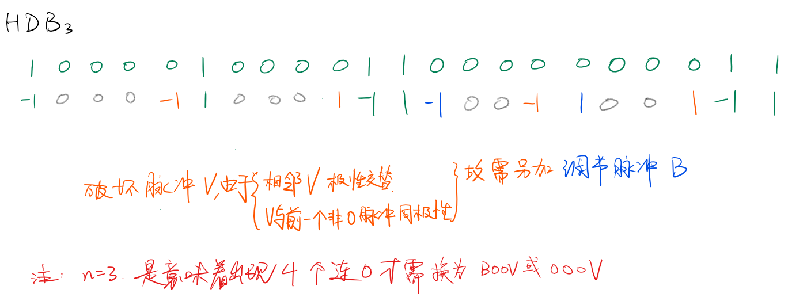

# 基带码型
1. AMI
2. HDB3码
   
3. 双相码（曼彻斯特码）
   
   使用01对替换0或1：   
   0->01;
   1->10
4. 4B3T码：   
   传输效率：$\eta=\frac{4}{3\log_{2}{3}}=84.12\%$

---
为防止出现译码时初始极性判断错误而出现所有信号完全相反的错误，可以在编码前先进行“差分编码”.

# 概念
1. 码元速率<->信息速率

    |   名称   |  别名  |       单位        |                    定义                    | 符号  |    备注     |
    | :------: | :----: | :---------------: | :----------------------------------------: | :---: | :---------: |
    | 码元速率 | 波特率 |    $\rm{Baud}$    | 每秒传输的符号数，或者叫码元数目（多进制） | $R_s$ | symbol rate |
    | 信息速率 | 比特率 | $\rm{bit/s}、b/s$ |         每秒传输的比特数（二进制）         | $R_b$ |  bit rate   |

    - 换算：$R_b=R_s \log_2{M}$
个码可能有多个bit
2. 误码率<->误比特率
3. 量化器的信噪比 
4. 调频灵敏度
5. 常见码型的功率谱密度主瓣宽度

与信息速率$R_b$之比

$$ 
\begin{array}{l|c|c|c}
    \text{调制方式}&\text{谱零点带宽}&\text{半功率带宽}&\text{99\%能量带宽}\\ \hline
    2PSK&2&0.88&20.56\\
    4PSK(QAM)&1&0.44&10.28\\
    8PSK&2/3&0.29&6.85\\
    16PSK(16QAM)&1/2&0.22&5.14\\
    MSK&1.5&0.59&1.18
\end{array}
 $$

记忆：实际上不应该比$R_b$，如果是与$R_S$之比，除了MSK的，其他几个都一样了：

$$ 比值=\frac{B}{R_b}=\frac{B}{R_S\log_2M} $$
只需记住$2PSK$的$B/R_S=2$即可：
其他只需除以$\log_2M$.

6. 常见数字调制信号的误码率

$$
\begin{array}{l|c}
    \text{信号}&\text{误比特率}P_b\\
    \hline
    2ASK&Q[\sqrt{E_b/n_0}]\\
    2FSK&Q[\sqrt{E_b/n_0}]\\
    2PSK&Q[\sqrt{2E_b/n_0}]\\
    MASK&\\
    MFSK&\\
    MPSK&\\
    QAM&

\end{array}
$$   

7. 最小码距
- 检测e个误码，要求$d_{min}\ge{e+1}$
- 纠正t个误码，要求$d_{min}\ge{2t+1}$
- 纠正t个误码，并检测e个误码，要求$d_{min}\ge{t+e+1}$

8. 易错：
   1. $B$是正半轴的带宽，是符号$BW$的一半；
   2. 